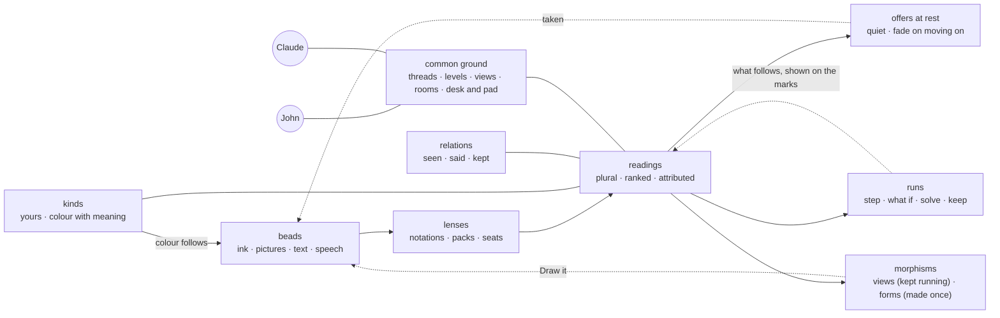
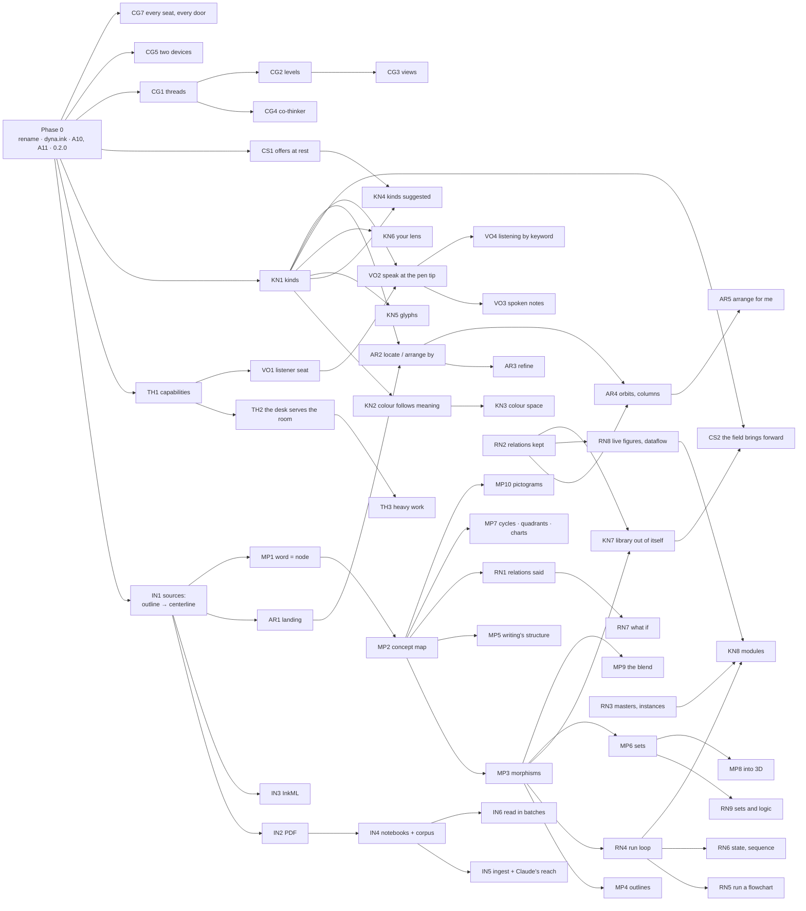

# dyna.ink v1 — the diagrammatic notebook that runs

*2 October 2026, revised five times the same day as John's directions accreted
(§13 keeps the record). dyna.ink is the product's name; what it is remains a
metamedium, in Kay's sense — the idea keeps that word, in lowercase
(`RENAME-PLAN.md` §1).*

*Sources read:*
- *his 2016 thesis: the page titled *As We May Sketch*, repository
  `jjh111/As-We-May-Write`;*
- *his OneNote notebooks of 2016–2018, his Wacom Inkspace drawings of 2017 and a
  whiteboard of 2021, all kept outside this repository (§12);*
- *the hand-over of 2 October (`GUIDE-2026-10-02.md`) and the plans in flight.*

*This **supersedes `V1-PLAN.md` §0 (what v1 is) and §11 (when v1.0.0
ships)**. Everything V1-PLAN built stands, and its scenarios A1–A10, with the
iPad's A11 (`QA-v1.md`), stay the floor. **Paths are written as they will stand
after the rename** (`RENAME-PLAN.md` N3c): `core/` is today's
`metamedium-core/`, `dynaink-3d/` is today's `shard-3d/`, and the MCP servers
are `dynaink` and `dynaink-3d`, as they now stand: the rename's N0, N1, N2 and
N3a–N3e landed on `master` on 2 October and the freeze is over. This spec lands
on John's word.*

---

## 0. In one paragraph

dyna.ink v1 is **a notebook that reads the way you think in diagrams, and runs
them**. Everything starts at the pen tip, with no mode and no colour to choose
first. You write and draw; the canvas reads what each mark is and what the marks
make together.

**It is not a whiteboard.** A whiteboard imitates a surface: a pen colour to
pick, shapes from a toolbar, notes stuck where they were left. This is a drawing
medium native to the computer, in Sketchpad's line. The ink is read, colour is
computed from meaning, where a thing stands means something, relations are kept,
and the drawing runs (§1.7).

**The canvas offers what it sees** — a relation the drawing almost has, a kind a
note seems to be, a run a diagram affords — quietly, beside the marks, with no
gesture asked. Whatever is free offers on its own: the engine, the device's own
models, the desk's models through the room. Whatever costs waits to be asked,
and is offered as the next step. Carry on elsewhere and the offer fades. Act on
it and it is taken or declined.

**What things mean is yours.** Say *it's an idea* and choose purple. *Idea*
becomes one of your kinds, and its colour stands in a colour space where hue,
lightness and saturation each mean something: kin are near hues, opposites
are complements, sub-kinds are a step lighter, and what is only offered is
paler than what was said. A note written among your ideas is offered their kind;
you can always change it. The canvas presupposes no kinds and no colours. It
ships a generic library made out of its own pieces, and the field brings any
library entry or kind forward the moment you type or say its name.

**You can run what you drew**: a flowchart steps with its values; a map of
causes answers *what if*; relations you set are kept as Sketchpad kept them.

**Everything you have ever drawn comes in as real ink**, from any source,
lands in order, and can be located or arranged by any attribute. You refine
messy notes, sort them into your kinds, and arrange them into orbits the board
reads back and keeps.

**You can speak to it.** Press to talk, or turn listening on and let keywords
start the acts. *This* and *here* mean what the pen holds and points at.

**It lives in two homes**: the desk, with its full power, and the pad, light and
deployed. The pad borrows the desk's power through the room when the desk is
there, and needs nothing but itself when it is not.

Claude sits in the room as a second hand. Everything either of you adds is
held, attributed, and yours to keep or erase.

## 1. Where it comes from

### 1.1 Sketchpad, 1963, and Put-That-There, 1980

Ivan Sutherland's Sketchpad, on MIT's TX-2, was drawn with a light pen and
commanded with push buttons. It began the line this project stands in:
- **The drawing was a structure, not a picture.**
- **Constraints.** The person set relations — parallel, perpendicular, equal
  in length, a point on a line — and the computer satisfied them. Dragging one
  part moved whatever was constrained to it.
- **Masters and instances.** A drawing defined once and placed many times, every
  copy changing when the master changed, and copies nesting inside copies.
- **Running the diagram.** It computed the forces in a drawn bridge truss and
  animated drawn linkages.

Richard Bolt's *Put-That-There* (MIT, 1980) joined voice to pointing: *that*
and *there* meant what the hand pointed at. Its descendant, Sketch-Thru-Plan,
sketch and speech together, is in the thesis's bibliography.

dyna.ink takes six things from these:
- **The field stands in for the buttons.** It shows the commands the marks most
  likely want, brings any library entry or kind forward by its name, and finds
  anything else by typing (`?` lists everything).
- **Offers at rest** (CS1), the buttons that light up without being pressed.
- **Relations the computer keeps** (RN2).
- **Masters and instances** (RN3), and modules built from them (KN8).
- **Diagrams that run** (RN4–RN9).
- **Speech that points with the pen** (VO2, VO4).

What it leaves is a general CAD solver: the relations kept are a closed
vocabulary, like every rung (§3.1).

### 1.2 The thesis, 2016 — dynaPlane, and running the diagram

John's Georgetown CCT master's thesis, *Symbols that Do, Intention that
Desires, Hands that Enact*, named its paradigm **dynaPlane**. The name echoes
Kay and Goldberg's *Personal Dynamic Media* and the Dynabook, both in its
bibliography; dyna.ink is dynaPlane's descendant. It set out:

- **Three stages.**
  1. Programming inside a graphics surface.
  2. Visual metaphors for programming concepts, where manipulating the symbols
     *is* the programming.
  3. Machine learning that removes modes: the system guesses what the hand
     means to do next, and design becomes a conversation.
- **The pen, and no modes.** Paper keeps a person in flow because it has no tool
  modes.
- **One environment** for UML, database and interface sketching, starting from
  free sketching rather than templates.
- **Conceptual blending** (Fauconnier and Turner) as the model of thought. Its
  figure `assets/blendingprogramming.PNG` blends two functions into an
  incomplete third, whose logic is then filled in.
- **Peirce**, and the idea that a computer can *run the diagram*.
- **Activity theory.** Operations make actions, actions make activities, and a
  motive drives them. The computer sees only the operations.

**What running the diagram means.** For Peirce, reasoning with a diagram is:
1. building it so that its parts stand in the relations of the thing reasoned
   about;
2. experimenting on it;
3. observing what follows, to find relations nobody put there.

dyna.ink already builds and reads. v1 adds the experiment and the observation:
- **By hand.** The hand moves a part, and the relations kept carry the rest
  (Sketchpad).
- **By program.** The notation's own rules step the diagram forward: a token
  through a flowchart, an event into a state machine, a change through a map of
  causes, numbers through a dataflow.

The third stage's guess at what the hand means next is what offers at rest are
(§3.4). They are made from evidence, shown quietly, and never imposed.

### 1.3 The practice — notebooks, a method, and colour

The OneNote pages (2016–2018; fourteen in one folder, ten read closely) show a
consistent way of thinking on paper. Every row below appears on several pages:

| What the pages do | dyna.ink on 2 October |
|---|---|
| **Words in space joined by arrows**; a word circled or boxed to make it a node; statements joined by down-arrows (a ladder of reasoning) | Letters gather into words and lines, and arrows are read. **The map is not**: a mind map's nodes must be shapes, and a word has no sites to tie to |
| **Circles as spaces**: nested, overlapping, stacked (*space slices*); the four circles of the blend network; Euler circles with elements | Relations only. **No notation reads sets or spaces** |
| **Braces and brackets** grouping a list; bullets; polar pairs; underlined headings | Lines of writing. **The structure of the writing is not read** |
| **Colour for a different idea**: four to six inks a page | **One colour per hand**; a stroke carries no colour |
| **Glyphs**: ★ ? ! ✓ ✗; a box or a cloud round a key phrase | **Not read** (and ✓ is the command mark) |
| **Sources under the ink**: excerpts with highlights, photos of book pages, screenshots, video thumbnails, links | Pictures are kept and drawn (I1). **Words in a page cannot be addressed; PDFs do not come in** |
| **Pictograms**: a brain, heads with thought bubbles, stick figures, tools, buildings, devices | Taught names, *What is this?*. **No pack** |
| **Charts and figures by hand**: curves on axes, the double diamond, a cycle, a triad, a 2×2 | Lines and arcs. **None read** |
| **Typed text beside the ink**: a title and date on every page | **Nothing brings it in** |

**The method**, as John describes his grad-school practice, which he did by
hand:
1. Write it messy, to capture.
2. Refine it.
3. Sort it by conceptual level: tasks, ideas, notes.
4. Move things into place to make **radial orbits** of tasks, and other
   constructions to reason and remember with.

It joins the structure of the computer to the freedom of an infinite canvas,
and AR carries it whole (§5.3).

**Colour, turned round.** On paper John switched pens for a different idea, so
the colour came first and stood for the meaning. In dyna.ink the meaning comes
first and the colour follows from it: a thing's kind, and what it stands in or
beside, give it its colour, in a colour space whose own relations carry meaning
(§3.3). Nothing is chosen at the pen tip, nothing is presupposed, and every
offer can be changed.

### 1.4 The data — past and present

Every source of John's ink found on this machine stores a pen stroke the same
way: as **a filled outline in its colour**. That holds whatever the device or
year:
- OneNote's PDFs, one tall page each, 500 to 6,400 outlines a page;
- the Wacom Inkspace SVGs of 2017, from a smartpad;
- a 2021 whiteboard export (2,146 outlines, 1,797 clones, 40 embedded pictures);
- Illustrator brush strokes in his drawings.

So one method — **outline to centerline** — brings back the pen strokes from
all of them. A prototype written for this spec (Python, in the director's
scratchpad, not committed) measured it:

| Source | Strokes | Faithful (covers 90% of the outline, stays on it 90%) | Within 80% on both | The engine read |
|---|---|---|---|---|
| OneNote page (reading notes) | 1,080 | 73% | 88% | replay 0.24 s, 171 words in 91 lines, 45 arrows — **no diagram** |
| OneNote page (research notes) | 1,543 | — | — | replay 0.27 s, 281 words in 131 lines, 83 arrows — **no diagram** |
| Inkspace diagram | 488 | 75% | 95% | replay 0.09 s, 135 words in 47 lines, 70 circles — **no diagram** |
| Inkspace diagram | 113 | 96% | 98% | 53 lines, 6 arrows — **no diagram** |
| Inkspace diagram | 166 | 84% | 96% | 20 words, 10 arrows — **no diagram** |

The misses are letters whose stroke crosses itself. Those need the junction walk
`core/src/image/trace.ts` already does for pictures. The whiteboard export and
the Illustrator drawings were inspected, not yet run.

**Speech is a source too.** At his desk John already turns recordings into
notes: faster-whisper with speaker labels, written into his notes vault. That
vault is not on this machine; IN1 reads one when it comes. The listener seat
(VO1) can use that same local Whisper — on the desk, and on the pad through the
room (TH2).

### 1.5 What is built, 2 October 2026

`GUIDE-2026-10-02.md` is the inventory. In short:
- **Readings.** The engine reads eight shapes, six roles, relations, concepts,
  and words from letters. It reads eight notations: flowchart, UML class,
  sequence, state, ER, mind map, garment piece, and *a diagram*. Mermaid goes
  out and comes back in.
- **The field** offers what held marks can become, from 25 registered tools
  ranked by context.
- **Editing.** Handles, magnets, and bindings that follow; bindings are the one
  relation kept today.
- **Maths**, solved figure by figure.
- **Running.** Programs and drawn creatures, on clocks the person starts.
  Frames wire values between artifacts, and a drawn slider is a control.
- **Packs and seats.** Library packs, and the reader, writer, decider and
  semantic seats.
- **The iPad.** Pictures, regions, Find across boards, reading a board in
  batches.
- **Live rooms**, with Claude's hand.

The one offer made at rest today is a clean form's ghost, shown for a moment
under a mark just drawn. An earlier chip that rose beside every loop was taken
out as noise (`CLAUDE.md`, *A loop that waits is plain ink*). CS1 is built so
that does not happen again.

There are 2,668 engine tests and 885 gate records. Release 0.1.0 was cut on
2 October, and the rename is under way.

### 1.6 The gap

**The engine reads a flowchart drawn for it, and does not yet read the way John
thinks.**
- It reads the words on every page of his, and none of the diagrams.
- Nothing he draws runs, except a program.
- It keeps one relation (a connector tied to a mark) and no other.
- It colours ink by whose hand drew it, not by what the ink means.
- It offers almost nothing until it is asked.
- It cannot locate or arrange anything by what it is.
- It cannot hear him.
- It treats the desk and the pad as the same machine.

### 1.7 Not a whiteboard

John, 2 October: *everyone is making whiteboards; we are trying a more native
computer drawing medium.* A whiteboard app imitates a surface: the hand picks a
pen colour, drags shapes from a toolbar, sticks notes and starts from
templates. The board keeps pixels and positions, and its AI draws a diagram
from a prompt. dyna.ink takes the other line, Sketchpad's and the Dynabook's:
the computer as a medium with powers paper never had.

| A whiteboard | dyna.ink |
|---|---|
| A colour picked before the first stroke | Colour computed from what a thing is, in a space whose axes mean something (§3.2, §3.3) |
| Shapes dragged from a toolbar | Shapes drawn, read, and redrawn clean on offer |
| Sticky notes and templates | Kinds made by first use, and a library made out of the canvas's own drawings (§3.9) |
| A thing stays where it was left | Where a thing stands means something, and the board reads it back (§3.7) |
| Connectors stuck to boxes | Relations seen, said and kept, as Sketchpad kept its constraints (§3.1) |
| A picture of a diagram | A diagram that runs (§3.6) |
| An AI that draws the diagram for you | Models that sit in as hands: they propose, and never paint over |
| Help behind a menu | Offers at rest: earned, quiet, gone when you move on (§3.4) |

**The rule it gives.** Where a choice lies between imitating paper or a
whiteboard and doing what only a computer can, take the computer's — and keep
the ink, which is never covered or replaced.

## 2. What v1 is

**For John first.** Personal software for a diagrammatic thinker: his daily
notebook on the iPad with the Pencil, and at the desk with Claude Code in the
room. The thesis wrote for *visual thinkers of all ages*, and what serves John
serves them (§10).

**Seven promises**, each carried end to end by one or two groups of units (§5,
§6):

1. **Bring it all in (IN).** Every file of hand drawing or notes — OneNote PDFs,
   Wacom and Illustrator SVGs, whiteboards, InkML, Markdown notes, photos and
   scans — comes in as real ink and text, in the colours it was drawn in.
   - Each source is kept, to be read again by a better reader.
   - Notebooks stay notebooks, and the corpus can be studied.
2. **Meaning is yours, and offered (KN, CS).**
   - Kinds are made by first use, and colour follows from kind and relation.
   - The colour space carries meaning.
   - Offers come at rest, with no gesture asked, from whatever is free; what
     costs waits for an act.
   - The field brings the library and your kinds forward.
   - The library is generic and made out of the canvas's own pieces, with
     runnable modules.
3. **Arrange and locate (AR).**
   - What comes in lands by one clear rule.
   - Anything can be located or arranged by any attribute, and put back.
   - Messy notes are refined, and arranged into orbits, columns and quadrants
     that the board reads and keeps.
4. **Think in maps (MP).**
   - Maps of words, sets, writing's structure, cycles, triads and pictograms are
     read.
   - **Morphisms** carry every reading into other forms, kept running as views
     or made once.
   - Two spaces can be blended.
5. **Run the diagram (RN).**
   - Relations said and relations kept.
   - Masters and instances.
   - Flowcharts, state machines, maps of causes, dataflow and figures that run.
6. **Together, in two homes (CG, TH).**
   - Threads, levels, views, and Claude as a co-thinker.
   - One board on the desk and the pad. The pad borrows the desk's power through
     the room, and stands alone without it.
7. **Voice (VO).** Press to talk, or listen by keyword. What is said goes
   through the same field as what is typed. Spoken notes become beads.

**Read with a pen (RP)** — highlights and margin notes tied to a PDF's words —
is specced in §6 and moves to **v1.1** (decision 1).

**What v1 is not.**
- Not a whiteboard (§1.7): no colour picker at the pen tip, no toolbar of
  shapes, and no presupposed meanings.
- No offer that interrupts the pen, and no metered call nobody asked for.
- No accounts and no sync service.
- No phone layout.
- No new shape rung and no new role.
- No general CAD solver.
- No listening that sends audio anywhere before a keyword.
- No model that commits anything or does arithmetic.
- No business layer in this repository (§10).

## 3. The model

John calls the vision the glass bead game: Hesse's game that plays the contents
of every field in one language of symbols. In this engine's terms:
- **beads** and their **relations**;
- **lenses** that read them;
- **kinds**, the person's own meanings, with colour that follows them in a space
  where colour itself means;
- **offers** made at rest;
- **morphisms** that carry a reading into other forms;
- **runs** that experiment on them;
- **common ground**, which holds it all between the hands, in two homes.

### 3.1 Beads and their relations

**A bead** is anything the board can point at: a mark, a word, a line of
writing, a symbol, a named thing, a region, a picture, a spoken note, an
artifact, a board. Beads exist already: nodes with ids that every hand names
alike (L1).

**Relations come in three kinds**, and v1 makes all three first-class:

| Kind | Who makes it | Examples | Today |
|---|---|---|---|
| **Seen** | the engine measures it | inside, crossing, near, same row, same size; a connector's ends | built (`relate/relations.ts`), ratio-based, with strengths |
| **Said** | a hand states it, held with its author | *causes (+/−)*, *is a*, *part of*, *leads to*, *equals*, *opposes*; read from a link's words or a glyph, typed or spoken; and between kinds themselves | only labels and names (RN1) |
| **Kept** | the engine maintains it while the hand works | on, at, inside, aligned, spaced, parallel, perpendicular, equal, distance, on a ring | only bindings that follow (E2), generalised in RN2 |

The rules hold for all three:
- A relation a model states is a proposal.
- A kept relation is derived at replay, never logged, so undo of a move undoes
  everything that followed it.
- A relation that cannot hold is said, with by how much. It never throws.

### 3.2 Kinds, and colour that follows meaning

**A kind** is the person's own word for what a thing is — *idea*, *task*,
*quote*, *person*, anything — with a colour and its examples.
- **Nothing is presupposed.** The canvas starts with no kinds. A kind is made by
  its first use: *it's an idea · purple*, typed or said.
- Its examples gather as the person keeps saying it (*it's an idea*), and the
  canvas starts to offer it for things like them (KN4, CS1).
- Kinds can be related to each other with said relations: *insight is a kind of
  idea*, *assumption opposes evidence*. Those relations shape their colours
  (§3.3).

**Colour follows meaning.** The pen tip has no colour choice. Ink is drawn in
the theme's ink, and takes on a colour when it means something, in this order:
1. **an override** the person set on that mark — the person's intervention
   always wins;
2. **its said kind**;
3. **an offered kind.** It belongs to a thing of a kind (a letter of a typed
   word, a member of a typed group, region or orbit ring), or it stands within
   reach of beads of one kind and no other (the *near* rule). Nearness **offers**
   the kind: it is drawn paler than a said one, and the person confirms it,
   changes it to another kind, or declines it (*not an idea*), and a decline is
   remembered;
4. **its source's colour**, for ink brought in as it was drawn;
5. **the ink**.

A connector whose ends share a kind takes that kind's colour; otherwise it stays
ink, so colour also says how things are related. Colour is derived at paint and
never logged; only overrides, kinds, classifications and declines are events. So
undo reverts it, and every hand in a room sees the same colours.

### 3.3 A colour space with meaning

The kinds' colours are not a fixed list. They are **generated in a perceptual
colour space** (OKLCH: lightness, chroma, hue), for any number of kinds. Each of
the space's three axes carries one meaning:

| Axis | Means | So |
|---|---|---|
| **Hue** | which kind, and its kin | each kind holds a hue. Kinds said to be related take **near** hues (analogous). Kinds said to oppose take **complementary** hues, across the wheel. Other kinds go where every eye tells them apart best from the kinds already held |
| **Lightness** | depth | each step down a family (*insight is a kind of idea*) keeps the parent's hue and moves a step toward the ground: lighter on paper, darker in the dark room. The theme moves lightness to keep contrast, and never moves hue |
| **Chroma** | how sure | a said kind at full chroma, an offered kind muted, a suggestion only a chip with no colour on the ink |

- **Arbitrary and modular.** The person can name any hue (*purple*, a hex, or the
  colour of a mark they point at). The space places it, keeping its meaning
  while fitting it to both grounds. The scale is part of the person's lens and
  travels with it.
- **The act keeps the hue.** A kind's hue is chosen when the kind is made or
  related, and written into that act, so a kind made later never moves an older
  one. A sub-kind, a kin or an opposite is kept relative to the kind it was
  placed against, and follows when that kind's hue changes. Lightness and chroma
  are derived for whichever ground is showing.
- **Placed for every eye, not by angle.** At one lightness a deuteranope can
  lose two hues 180° apart, so an even spacing of angles promises nothing. A new
  hue goes where it is easiest to tell apart from the others: typical sight
  first, colour-blind sight a close second, on both grounds. A new opposite pair
  is placed together, on the axis where both stand most apart.
- **Colour that reads.** Because relations between kinds are kept in the hues,
  the engine can say what the colours on a board mean: *these two kinds are drawn
  as opposites*; *these three are one family*.
- **Side by side.** Colours change each other when they stand together
  (Albers's *interaction of colour*). Kinds whose ink stands side by side on a
  board are kept apart by a minimum distance in the space.
- **Legible and fair.** Every kind's ink is checked for contrast against both
  grounds (at least 3:1 for marks, 4.5:1 for words), and checked again under
  simulated colour blindness. Kinds that collapse there get a second channel —
  a pattern on their shapes and connectors, and a small mark on hover for their
  writing — and the lens pane says so. Past about eight kinds, a dichromat
  cannot tell every pair apart by colour at one lightness. The second channel
  does that work, and it never uses lightness, which means depth.
- **Computed by the engine, drawn as sRGB**, so every supported browser draws
  it. The brand's signal colours (read, held, confidence, a model's) stay on the
  chrome, chips and ghosts, never on ink, so a kind's blue never says *read*.
  Automatic placement leans away from those hues. A hue the person names may
  sit beside one — John's purple stands 9° from the violet the chrome uses for a
  model's work — and the board says so. A clean form is the mark's own form, so
  it takes the mark's colour (KN2).
- **Seen first.** On 2 October the space was built as a page John can use before
  any of it is in core: his kinds and the spec's examples, both grounds, the three
  simulations, and the board saying what its colours mean. Its functions are
  KN3's starting point. The page is `brand/colour-space.html`, beside the
  styleguide, and reads its two grounds and the chrome's signal colours from
  `tokens.css`.

### 3.4 Offers at rest

The canvas offers without being asked. These are the buttons that light up
without being pressed, the third stage's guess at what the hand means next. An
earlier chip that rose on every loop was taken out as noise, so offers at rest
follow six rules (CS1):
1. **Earned.** An offer appears only when the evidence is strong and specific to
   these marks: the drawing almost has the relation, the notation reads above its
   floor and its run exists, a kind fits by placement or by meaning. It never
   appears for a lone generic shape, for a word still being written, or for a loop
   that waits.
2. **One, and quiet.** The strongest offer only, as a chip beside the marks it is
   about (the match chip's place and look). It never covers ink, never opens a
   field, never makes a sound, never takes the pen.
3. **Gone by moving on.** A stroke elsewhere, a pan, or a few seconds of other
   work fades it. It can come back when the hand returns to these marks.
4. **Answered on the offer.** A tap takes it, as one act and one undo. *Not
   this* declines it, and the decline is remembered for these marks, so it never
   nags.
5. **Eagerness follows cost** (decision 8). Whatever is free may act and offer
   unasked. That means the engine, the seats on the device, and the desk's own
   local models through the room: the person's machines, with nothing metered.
   - Free is not weightless. A local server answers one call at a time, so an
     unasked call waits until the hand rests and keeps to a budget. It gives way
     the moment the person asks for anything; the transport's old lesson is that
     the person's request outranks a speculative one.
   - Whatever is metered is never asked without a deliberate act: a hosted model
     by key, and Claude Code's seat while it is set *paid*. Its cost is a setting
     (decision 21). It is paid by default, since it spends a subscription's usage
     and wakes a session. It is *unpaid* while a session is here for the purpose
     — a dev session walking the doors, a co-thinking one — and then it acts at
     rest like any free seat (§3.13).
   - **Each rung offers the next.** When the free rungs cannot settle something —
     writing no free reader could read, a question beyond them — the offer at
     rest is the step up itself (*ask Claude?*, with the dot), taken only by a tap.
6. **Each kind of offer can be turned off**, a device preference: *stop offering
   to keep things parallel*.

**Writing is read at rest** this way when a reader is free: on the device, or the
desk's through the room. The smallest such reader reads only what the engine
takes for writing, a line once the hand has moved on, within the budget. So Find
has the words, and kinds can be suggested by meaning (KN4) without anyone
asking. The *auto-read* tile is on by default while a free reader is present
(decision 22), and off otherwise. The lesson that made it off stands: once, every
stroke went to every model, hosted ones included, while the pen was still
moving. Now only the free rungs act, and only at rest.

The first offers at rest:
- *Keep them parallel* (RN2);
- *Make it an orbit* (AR4);
- *Run it*, on a flowchart that can run (RN4);
- *idea?*, a kind by meaning (KN4);
- the offered kind by nearness (KN2);
- *Tie to “frames”*, for a connector that ended by a word it did not bind to
  (MP1);
- *Outline it*, for a map grown past a dozen ideas (MP4);
- the clean form's ghost, which exists today.

### 3.5 Morphisms

A **morphism** carries a reading into another form and **preserves what the
reading says**: nodes stay nodes, links stay links, containment stays
containment, order stays order. One that cannot carry everything says what it
dropped; a map with cross-links becomes an outline with *see also*.

- **A view is a morphism kept running.** It is derived on every paint and never
  logged, so it is always in step: a live outline beside a map, the Mermaid
  beside a flowchart, an arrangement of the board.
- **A made form is a morphism taken once.** It is an artifact in the log that
  carries `from` (the source's ids, the lens and its version, the reading's
  key). It is versioned and editable, and can diverge. It says when its source
  has moved on, and offers *bring it up to date*.
- **Morphisms compose.** `from` records the chain, so any form traces back to
  its ink.
- **The round trip is the test.** A form that has a reader, drawn back, reads
  the same (D3's rule).
- **Manual morphisms are the hand's**: moving, reshaping, refining,
  rearranging. Relations kept carry them through the diagram.
- **Programmatic morphisms are the engine's** (layouts, translations, runs) **or
  a seat's** (the blend, a summary). A seat's are always proposals.

### 3.6 Running

A notation can register a **runner** beside its Mermaid writer (RN4). A run:
- is started by the person's act and stopped by Esc ("nothing runs unblessed");
- has a state derived from the log, the inputs (a drawn slider, a typed or
  spoken value) and the step, and is never logged;
- shows what changes on the marks — a token, a highlight, a value written beside
  a node, a sign on a link — and says each step in the status line;
- can be **kept as a form**: its trace becomes a timeline or a sequence
  diagram beside the drawing (a morphism from a run to a form).

Running by hand and by program are one experiment. The hand moves a part and
the kept relations carry the rest (RN2). The program steps the notation's own
rules (RN5–RN9). Either way the observation is drawn on the diagram, which is
Peirce's third step.

### 3.7 Where a thing stands can mean something, and the reverse

The computer's structure and the canvas's freedom meet in placement. It works
both ways:
- **Reading meaning from placement.** Standing in a region named for a kind, a
  bead is offered that kind (§3.2). On an orbit's inner ring it is at that
  ring's level. In a column named *doing*, that is its state. In a quadrant, its
  two attributes. On a timeline, its date.
- **Placing by meaning.** *Arrange by kind* puts the ideas together.
  *Arrange as an orbit* puts them on rings. *Locate by date* finds them in
  time.

A **construction** is a form that declares the mapping: an orbit, columns, a
quadrant, a ladder, a timeline, a cluster (AR4).
- **Arrangements are views** until the person keeps one. The hand's layout is
  the memory, so it is never moved without a deliberate act, and every move is
  shown travelling.

### 3.8 The command surface, by pen and by voice

The field shows the few commands the held marks most likely want, ranked by
what they are and what stands beside them (B1, B2). It stands in for
Sutherland's buttons.
- **It brings everything forward by its name** (CS2): every library entry
  (templates, modules, primitives, the packs' definitions), every one of the
  person's kinds (with its colour), and every relation word.
  - Typed or said, *orbit*, *counter*, *idea* and *causes* each lead straight to
    their act: place, place, give the kind, relate.
  - A row of the person's kinds, most used here first, gives the held marks a
    kind in one tap.
- **It opens on empty ground too.** Press and hold where nothing is, and the
  field opens there, to place a library entry or start a note of a kind.
- **Everything else is a word away** (`tools/intents.ts`; `?` lists all of it).
- **Offers at rest** (§3.4) are the field's commands that come to the marks
  unasked.

**Voice is a second way into the same field**:
- What is said is read by the same reader as what is typed, and the line still
  says what will happen before it is done.
- *This* and *these* mean what the pen holds or touched. *Here* and *there* mean
  where it points.
- **Press to talk**, or turn **listening by keyword** on (VO4). Listening is
  always on while switched on, and only phrases that start with a keyword — the
  wake word, a kind's name, a verb — are acted on. The keywords are spotted on
  the device, and no audio leaves it before one.

### 3.9 A library made out of itself

**A pack is a board** (KN7). Any board can become a pack: its named things,
kinds, masters, modules and constructions, drawn on it, are the pack's content,
kept at a version by hash. The shipped library is made the same way, drawn in
dyna.ink.

It is **generic**: primitives, connectors, containers, constructions, relation
words, runners and modules, carrying no kind of meaning. The person's kinds and
lens give the meaning, so the library stays open. The field brings every entry
forward by its name (CS2).

### 3.10 Two homes: the desk and the pad

The same app, the same log, two very different machines:

| | The desk | The pad |
|---|---|---|
| **Where** | `localhost` and dyna.ink in a desktop browser, beside Claude Code | dyna.ink installed on the iPad |
| **Power** | local models (Ollama, LM Studio, Whisper), folders on disk, the ingest command, a big screen, Claude Code in the room | the Pencil, the engine, on-device models through WebGPU, the device's dictation |
| **Limits** | — | Safari's storage and memory; no folder access; no plain-http calls to the LAN; models only as downloads it can hold |

Holding both gracefully means four things:
1. **Capabilities are discovered, never assumed** (TH1). The app knows what this
   device can do and what the room offers. Each feature says what it needs and
   where it can get it, and never fails silently.
2. **The pad borrows the desk's power through the room** (TH2). When the desk is
   in the room, its seats — its models, its Whisper, Claude at the desk — answer
   the pad's briefs, through the same parked-brief channel the Claude Code seat
   uses (J4). The router's order becomes: the engine, then the device's own
   seats, then the desk through the room, then a hosted seat by key. The first
   three are free and may act at rest within the budget. The last is metered and
   waits for an act (§3.4).
3. **Heavy work goes where the power is** (TH3): bringing in a notebook, reading
   it in batches, embedding its words. On the pad alone it is done within the
   pad's budgets, and said.
4. **Everything degrades to tiers 0 and 1**, which run everywhere and offline.

### 3.11 Seven grammars

Every kind of diagram carries its meaning in a few spatial grammars, usually
more than one at once:

| Grammar | Meaning carried by | Reads today | v1 adds |
|---|---|---|---|
| **Connection** | lines and arrows between things | heads, magnets, the graph notations, routing | words as nodes, concept maps, signed links, runs |
| **Enclosure** | inside, overlapping, nested | relations, frames, regions | sets with zones, spaces, logic; kinds offered by belonging |
| **Arrangement** | position along axes, rings and order | rows, columns, the sequence's order | orbits, columns, quadrants, timelines, arrangements by attribute |
| **Figure** | resemblance | shapes, taught names, packs | pictograms, masters, instances, modules |
| **Writing** | words | words, lines, the reader | lists, braces, ladders; speech |
| **Mark-up** | marks about marks, and colour | scratch and strike | kinds, colour with meaning, glyphs, highlights |
| **Number** | quantities | the maths lane | live figures, dataflow |

**Depth** runs across all of them (DynaInk3D, the graph in 3D, sets as volumes,
space slices).

### 3.12 Activity, from the thesis

- Operations are strokes and words spoken.
- Actions are acts (one `withTool` act, L2j).
- Context (B2) reads the activity round the hand.

v1 adds three readings to context:
- the board's kind (a notebook page, a map, a run, a source);
- the person's kinds (KN6);
- the home the hand is in (TH1).

With them, *idea* means to the engine, and to Claude, what it means to John, and
an offer on the pad does not assume the desk.

### 3.13 Every seat, every door, first-hand

Claude Code is more than one model among the others. It can sit in **any seat**:
reader, writer, decider, semantic, listener, the desk's. It answers each seat's
briefs in that seat's own contract, through the prompts, parsers and channel a
model uses — J4's rule: the seat is a model, and that is the whole of it.

It can also **simulate**: take a seat *as* something — a small reader that
misreads, a decider whose answer is split, a model that refuses or replies badly —
to see how the pipeline handles it. A simulated answer always says it is one,
and never counts as evidence about a real model.

So a dev agent can use **every door first-hand**:
- the pen, through the hand;
- every seat;
- MCP both ways;
- the room and its relay;
- every format in and out: the log, the bundle, SVG, PNG, PDF, Mermaid, a lens,
  a notebook directory.

The pipeline is understood by using it, and the formats are reasoned about as they
actually flow. The contracts have one home, the code, and the hand reads them live
(`canvas_doors`), never from a copy in a document (CG7).

Whether Claude Code's seat costs is a setting (decision 21): *paid* by default,
asked only by an act; *unpaid* while a session is here for the purpose, when it
may act at rest like any free seat (§3.4).

## 4. The atlas — every kind of diagram: what reads it, what runs it

| Kind | Grammars | Reads today | v1 reads | Runs as (v1) | Units |
|---|---|---|---|---|---|
| Flowchart | connection | D1, Mermaid out and in | — | **a token with values; decisions by comparison or by asking** | RN5 |
| State diagram | connection | read | — | **events step it** | RN6 |
| Sequence diagram | arrangement, connection | D5 | — | **messages play in order** | RN6 |
| UML class, ER, mind map of shapes | connection, enclosure | D4, D6 | — | — | built |
| Boxes joined by tied connectors | connection | *a diagram* | — | — | built |
| Maths figure, sheet, garment piece | number | solved, checked | — | **kept by its labels while dragged** | RN8 |
| Molecule; a graph in 3D | connection, depth | `basics@1`, `graph3d` | — | turns in 3D (built) | built |
| Page layout → a living page | enclosure, arrangement | built | — | the page itself | built |
| **Your kinds** (idea, task — whatever you name) | mark-up, writing | — | **made by first use; offered by nearness and meaning** | — | KN1, KN2, KN4 |
| **Colour itself**: kin, opposites, depth, certainty | mark-up | — | **a colour space with meaning** | — | KN3 |
| Concept map of bare words | connection, writing | words, arrows | **yes** | *what if*, when links are signed | MP1, MP2, RN7 |
| Map of causes (signed links) | connection | — | **yes** | **what if X rises; loops named** | RN1, RN7 |
| Dataflow (boxes with expressions) | connection, number | frames wire artifacts | **yes** | **values flow; sliders are inputs** | RN8 |
| Modules from the library | connection, figure | — | **placed by name, wired** | **they run** | KN8, CS2 |
| Lists, braces, ladders, polar pairs | writing, mark-up | lines | **yes** | — | MP5 |
| Euler and Venn sets | enclosure | relations | **yes** | **membership questions answered** | MP6, RN9 |
| Peirce's existential graphs | enclosure | — | **yes** (cut first) | **truth evaluated; rules as moves** | RN9 |
| Nested spaces (space slices) | enclosure, depth | regions | **in 3D** | — | MP8 |
| The blend network | enclosure, connection | — | **made by a seat** | — | MP9 |
| Cycle, triad | connection | — | **yes** | a cycle steps round (RN4) | MP7 |
| 2×2, timeline, a chart drawn by hand | arrangement | — | **yes** | a chart's curve sampled to data | MP7 |
| **Orbit, columns, ladder, cluster** | arrangement, enclosure | regions | **yes, offered at rest, placed from the library** | **kept: on the ring, in the column** | AR4, KN7, RN2, CS1 |
| **Any beads, arranged by an attribute** | arrangement | grid and focus views | **views and kept arrangements** | — | AR2, AR5 |
| Pictograms | figure | taught names | **a pack** | — | MP10 |
| Masters and instances | figure | — | **yes** (cut early) | **instances follow the master** | RN3 |
| Glyphs (their meanings yours) | mark-up | — | **yes** | — | KN5 |
| Spoken notes | writing | — | **beads with transcripts** | — | VO3, VO4 |
| Solids from drawn views | depth | DynaInk3D, apart | **beside the app** | — | MP8 |
| Highlights and margin notes on a source | mark-up, writing | ink over a living page | **v1.1** | — | RP |
| Storyboard; screens → a clickable prototype; use case and activity diagrams | arrangement, figure | partly | after v1 | — | §9 |

## 5. The workflows, and what each irrigates

A spike is one workflow from real use, carried end to end through every layer.
Each builds pieces that reach the workflows round it, listed as *what it
irrigates*.

### 5.1 IN — bring it all in

**The workflow.**
1. At the desk, John points the ingest command (IN5) at a folder: OneNote PDFs,
   Inkspace SVGs, scans, Markdown notes. On the pad, he picks files, and the
   heavy part goes to the desk when it is in the room (TH3).
2. Every file is read by its adapter (IN1–IN3) into real strokes in the colours
   they were drawn in, with pictures and text. Each source file is kept.
3. The files land by one rule (AR1), in notebooks (IN4), named and dated as
   their sources were.
4. *Read this notebook* (IN6) reads the handwriting in batches, saying its cost
   first.
5. The corpus pane (IN4) studies all of it. *Name what this colour meant* turns
   an old notebook's pens into his kinds at once.

**What it irrigates.**
- One door for every format.
- A corpus of John's real hand for every reader's bench: tens of thousands of
  strokes from three devices and nine years.
- His old colours, carried into his new kinds.

### 5.2 KN and CS — meaning is yours, and offered

**The workflow.**
1. John writes *try to see if network graphs and topography can correlate —
   their hidden metric against the overt topography*, holds it, and says *it's an
   idea, purple*. The note turns purple, and *idea* is a kind in his lens (KN1,
   KN2).
2. He says *insight is a kind of idea*. Insights take a purple a step lighter.
   He says *assumption opposes evidence*, and the two take hues across the wheel
   from each other (KN3).
3. Days later he writes a similar thought. Beside it, at rest, a quiet chip:
   *idea? 0.81*, read by meaning on the device. A tap and it is purple. If he
   keeps drawing elsewhere, the chip fades (KN4, CS1).
4. A note written among the ideas is offered their kind, drawn pale. *Make it a
   task* changes it, and *not an idea* declines it for good (KN2).
5. He draws two nearly parallel lines. *Keep them parallel* waits beside them
   until he moves on (CS1).
6. He holds empty ground and types *orb*. The field completes to *Place an
   orbit*, from the library, and it stands there with its rings kept. *Counter*
   places a module he can wire to a slider and run (CS2, KN7, KN8).

**What it irrigates.**
- Meaning that every arrangement, find, run and brief reads.
- Colour that is signal by construction, whose relations read as meaning.
- A library anyone extends by drawing.
- An engine that offers, quietly.

### 5.3 AR — arrange and locate

**The workflow (John's grad-school method, one act at a time).**
1. Forty files of mixed kinds land in date order (AR1).
2. *Locate by source*, *by colour*, *by kind* rings what matches. *Arrange by
   date* lays everything along time, and the hand's layout comes back with one
   tap (AR2).
3. A messy page is held and refined: shapes clean, writing set as text, lines
   aligned, the ink kept beneath (AR3).
4. Its lines are given kinds: said, offered by placement, or suggested by
   meaning (KN).
5. He moves the tasks round the project's name. *Make it an orbit* is offered at
   rest. Taken, the board keeps them on the ring, and a note dropped near the ring
   is offered the task kind (AR4, RN2, KN2, CS1).
6. *Arrange the ideas as an outer ring* proposes their places as ghosts, and he
   keeps them or adjusts by hand (AR5).

**What it irrigates.**
- Placement that means something.
- Find by any attribute.
- Spatial memory respected by design.

### 5.4 MP — think in maps

**The workflow.**
1. Words joined by arrows, circles round words, a brace, overlapping sets. The
   field reads *a concept map 0.81* or *sets: A, B, C*.
2. *Outline it* stands a live outline beside the map. *Make it Mermaid* makes a
   form that says when the map has moved on.
3. *Blend these*: Claude proposes the generic space, the mappings and the blend
   as held proposals.

**What it irrigates.**
- Words as nodes for every diagram.
- One morphism contract for every form.
- Enclosure reading for sets, spaces and logic.

### 5.5 RN — run the diagram

**The workflow.**
1. A loop with *n = n + 1* and *n < 3?*. *Run it*, offered at rest: a token
   walks, *n* counts up, and the run stops at 3. *Keep this run* gives a
   timeline.
2. On a map of causes with *+* and *−*, *What if demand rises?* marks every node
   up or down and names the loop.
3. Two lines kept parallel and a box kept equal to another: drag one, and the
   rest follow.

**What it irrigates.**
- A runner contract every notation can join.
- Maths live under the hand.
- Modules for the library (KN8).

### 5.6 CG and TH — together, in two homes

**The workflow.**
1. On the pad, on a notebook page with Claude in the room, John writes or says
   *@claude what connects these?* as a note on a region, and it wakes the
   session.
2. Claude replies in the thread, proposes beside the marks, and offers a view.
3. He asks the pad to read the page. The desk is in the room, so its reader
   reads it. The seat row says *read at the desk*, and nothing is sent anywhere
   else (TH2).
4. The desk leaves. The capabilities pane says reading now needs the on-device
   reader, or the desk back, and the ask is kept until one is there (TH1).
5. Zoomed out, regions show titles, summaries and their kinds. The same board is
   open on the Mac.

**What it irrigates.**
- Comments.
- Legible big boards.
- One board across devices.
- Full power anywhere the desk can reach, and graceful limits where it cannot.

### 5.7 VO — voice

**The workflow.**
1. Holding a group of notes, John presses to talk: *these are tasks, orange*.
   They are given the kind and coloured, and the line says what it did.
2. Pointing at empty ground: *put the tasks here*.
3. He turns listening on and keeps drawing. Saying *idea: try to see if network
   graphs and topography correlate* puts a purple idea note at the pen tip.
   Everything he says without a keyword is heard by nothing and kept nowhere
   (VO4).
4. At the desk, a recorded conversation comes in as notes, one per turn, through
   his own Whisper.

**What it irrigates.**
- Acts with no hand free.
- A second channel for meaning: what is said about what is drawn.
- Access for anyone who cannot write easily.

## 6. The units

Each unit takes the form `DIRECTOR-PLAN-W2.md` set: **owns**, **what**, **red
first** (the test that fails on `master` before the change), **checks**,
**invariant** (the one it is most likely to bend) and **trap**. Every unit
also:
- runs the whole suite (`RENAME-PLAN.md` §6, after the rename);
- updates `CLAUDE.md` where it changes a structure, and `HELP.md` where it
  changes what a person is told;
- adds its dated status line under its heading here.

**The private bench** (`node scripts/ingest.mjs --bench <folder>`) reads John's
own files on his machine only. It prints numbers, never content (§12).

### IN — bring it all in

**IN1 — Sources: one way in for every file.**
- **Owns:**
  - core `ingest/` (new):
    - `source.ts`: the intermediate **ink document** and its provenance;
    - `ink-outline.ts`: outline → centerline, by pairing a ribbon's two sides,
      else by thinning the outline and walking its junctions with
      `image/trace.ts`'s own thinning and straightest-branch walk; fills, not
      subpaths; even-odd fills and holes;
    - `svg.ts`, the SVG adapter: paths (every command, relative and absolute);
      nested transforms; `<use>` and `<symbol>`; groups and layers; stroked paths
      as drawn; pen-shaped fills through `ink-outline`; `inkscape:original-d`
      where a path effect kept its source line; `<image>` → pictures;
      `<text>` → text; units from `viewBox`, `width` and `height`;
    - `markdown.ts`: a note becomes a text bead; `[[links]]` become said
      `links-to` relations (RN1); `#tags` become kinds offered to the person
      (KN1), never made without the person's yes;
    - `raster.ts`: pictures as I1 keeps them;
    - `index.ts`: `ingest(bytes, name)`, chosen by sniffing the bytes;
    - `fixtures/`: synthetic files in each outline style found — OneNote's
      ribbons, Inkspace's Béziers, a whiteboard's even-odd polylines,
      Illustrator's brush outlines — plus stroked paths and a small vault.
  - the surface: `18-images.js` routes every file through `ingest`.
- **What:** the foundation every source builds on.
  - **An ink document**: pages of strokes (points, with time and pressure where
    the source has them; **the colour and width they were drawn in**; paint
    order), pictures (by hash, with boxes), text runs and links.
  - **Provenance**: `source { hash, name, format, tool, created, page }`. Each
    import says where it came from.
  - **The source colour is kept** on every imported stroke and drawn as it was
    (KN2's fourth rule), until the stroke is given a kind.
  - **The source is kept** as an asset by its hash, as pictures are. A better
    adapter can read it again: re-ingest writes a new version of the import
    beside the old (both held), and the bench compares them.
  - **A designed SVG** (mostly shapes and text) comes in as a figure, as today.
    A **drawn one** (pen-shaped paths) comes in as ink. *Read it as ink* and
    *Keep it as a figure* switch between them.
- **Red first:**
  - core: the synthetic corpus in every outline style is at least **95%
    faithful**, every shape reads as its source did, and every stroke keeps its
    source colour.
  - core: stroked paths are exact. Nested transforms and `<use>` land a known
    figure where it belongs. Millimetres and inches arrive at the hand's scale.
  - core: a vault's links arrive as relations and its tags as offered kinds.
  - core: a malformed file is refused with its reason, never thrown (DATA-1).
- **Checks:** the engine suite; the bench; the private bench, numbers only.
- **Invariant:** once imported, a stroke is a stroke. The engine reads it
  exactly as a hand's, and no reading depends on its colour.
- **Trap:** a whiteboard export carries thousands of clones and masks. Expand
  the clones, skip the masks and say so, and cap the work on one file with a
  sentence, never a frozen page.

**IN1a status, 7 Oct 2026: done on `unit/in1-sources`** — core `ingest/`: the ink document and its provenance; outline
to centerline, a ring's two sides paired from its caps, else the fill thinned and walked with `image/trace.ts`'s own
thinning, fidelity deciding and kept on each stroke; the SVG adapter over a tokenizer written by hand (stroked paths
exact, pen-shaped fills read back, nested transforms, `<use>` read once and moved, units, `inkscape:original-d`, text,
pictures, links, masks and clips skipped and said, drawn or designed with its evidence); notes and pictures as data;
`ingest(bytes, name)` by the bytes, never throwing. The synthetic corpus in five styles 100% faithful and reading as its
source; **John's 31 Inkspace drawings, 3,074 outlines: 91.2% faithful, 98.5% within 80%** (the prototype: 75–96%), 1.05
ms an outline; a whiteboard-sized synthetic file of 2,146 outlines and 1,797 clones in 0.4 s. Core 3,288 tests with the
colour space beside it. Not yet: the surface routing every file through `ingest`, the source kept as an asset, source
colours drawn, the drawn/designed switch (IN1b); PDF (IN2), InkML (IN3); the whiteboard and OneNote pages measured.

**IN2 — PDF: ink, pages and words.**
- **Owns:** core `ingest/pdf.ts` (over pdf.js's operator list); the surface
  `18-pdf.js` (pdf.js loaded lazily, from a copy the app serves itself);
  `17-assets.js` (tiles); the offline shell; the CSP list in `cloudflare/`.
- **What:**
  - A page whose paths are ink becomes ink through IN1: OneNote, and smartpad
    and note apps' exports.
  - A typeset page becomes a picture whose **words** are held with their boxes,
    for Find, for ink that addresses them (RP1), and with no need to *Read the
    picture*.
  - Embedded images become pictures; links are kept.
  - A page taller than a picture's long side is tiled.
  - OneNote's title and date (typed text at the top) name and date the board.
  - pdf.js is Apache-2.0, listed in `NOTICE` (N2).
- **Red first:** core — a synthetic OneNote-style page comes back as strokes in
  its colours, its picture and title in place. e2e — a two-page typeset PDF;
  Find finds a word on page 2; a reload and the bundle keep everything; no
  request goes to a CDN.
- **Checks:** `node e2e/run.mjs boards keep app`; budgets: a 6,000-stroke page
  replays within 1.5 s on the bench machine (`bench/budgets.test.mjs`).
- **Invariant:** a picture is kept and drawn (I1), and never traced unless
  asked.
- **Trap:** pdf.js's worker. Serve it from the app's own path and put it in the
  offline shell, or the CSP refuses it.

**IN3 — InkML.**
- **Owns:** core `ingest/inkml.ts` and fixtures.
- **What:** the W3C format for digital ink: traces with x, y, time and pressure,
  and brushes. It is what OneNote's Microsoft Graph interface returns with its
  ink, and what Windows and Wacom tools export. Strokes come in with real
  timing, pressure and colour. It is the door for OneNote through Graph (§9).
- **Red first:** core — a synthetic InkML file with three traces and two brushes
  gives three strokes with times, pressures and colours.
- **Checks:** the engine suite.
- **Invariant:** a point's time and pressure are kept as they came, and no
  reading depends on them.
- **Trap:** InkML's channels can come in any order and units. Read the trace
  format, never assume x then y.

**IN4 — Notebooks and the corpus.**
- **Owns:** the surface `17-boards.js` (pure: a board's notebook and section),
  `22-boards.js` (the pane), `17-folder.js`, `17-find.js` and `26-find.js`
  (Find scoped); core `search/` (facets) and a new `corpus/` (the index, pure).
- **What:**
  - A **notebook** is a named group of boards with optional sections. Bringing
    in a folder makes one. A board is a page, named and dated by its source;
    moving it changes its list entry, never its journal.
  - **The corpus** is a derived index across every board: provenance, dates,
    tools, and counts by reading (words, notations, glyphs, source colours,
    kinds).
    - A study pane shows it, and arranges boards as beads (AR2 over boards).
    - It writes `corpus.jsonl` for analysis elsewhere.
    - Re-ingest with a newer adapter shows what changed.
  - **Name what this colour meant.** The corpus lists the source colours a
    notebook was drawn in. Giving one a kind (*red was questions*) gives every
    stroke of that colour in that notebook that kind, in one act. The old
    practice, colour first, becomes the new one, meaning first.
- **Red first:** e2e — a zip of three synthetic files becomes a notebook of
  three boards with their titles and dates. Find is scoped to it. A source
  colour named as a kind gives its strokes the kind, and one undo takes them
  back. Core — the corpus index is a pure function of the boards' logs.
- **Checks:** `node --test Demos/surface/17-boards.test.mjs`; `node e2e/run.mjs
  boards keep`.
- **Invariant:** a board is its log (R1). The notebook belongs to the list, and
  the corpus is derived.
- **Trap:** dates. A source's own date is not the import's. Keep both, and say
  which one an arrangement uses.

**IN5 — The ingest command, and Claude's reach.**
- **Owns:** `scripts/ingest.mjs` and its test; three tools in `Demos/mcp.mjs`;
  `pdfjs-dist` as a dev dependency of the scripts, never of core.
- **What:**
  - `node scripts/ingest.mjs <file|folder> --out <dir>` runs IN1–IN3 in Node. It
    writes one `.dyna.zip` a page and `notebook.json` (titles, dates, sections,
    thumbnails, the search index, the corpus). The app opens it, on the desk or
    the pad.
  - Claude gains read tools over such a directory: `notebook_find`,
    `notebook_look`, `notebook_see`. With them it can answer *where did I write
    about blending?*, list every idea across a year, or read pages no reader has
    read.
  - The directory is John's to name (`MM_NOTEBOOKS`), and the hand reads nothing
    else.
- **Red first:** the MCP smoke ingests the synthetic notebook, then finds,
  looks and sees.
- **Checks:** `node --test scripts/ingest.test.mjs`; `node Demos/mcp-smoke.mjs`.
- **Invariant:** nothing leaves the machine that John did not send.
- **Trap:** pdf.js in Node wants a canvas for images. Take images as the PDF
  holds them instead: JPEG passes through, and Flate rows are re-encoded as PNG.

**IN6 — Read in batches.**
- **Owns:** the surface `06-handwriting.js` and `22-boards.js` (a queue across
  boards), `04-seatpane.js` (the cost); `Demos/mcp.mjs` (`canvas_read`).
- **What:**
  - *Read this notebook* queues every unread line on every board, using I8's
    numbered sheets, eight lines to a batch, by whichever reader the home offers
    (TH2: the device, the desk through the room, Claude, or a hosted seat).
  - The pane shows progress, the cost so far, and the estimate before it starts.
    It can be stopped and resumed. Transcripts make Find whole, and give KN4 the
    words it suggests kinds by.
  - Claude's hand gains **`canvas_read`**: a scope's unread lines on one
    numbered sheet, read by the hand itself and transcribed in one call.
- **Red first:** e2e with the stub reader (two boards, stop, resume, found); the
  MCP smoke for `canvas_read`.
- **Checks:** `node e2e/run.mjs models boards hand`.
- **Invariant:** a whole notebook is a job the person starts, and it says its
  cost first. A metered reader is asked only by that act. A free one reads a
  line at rest within its budget (decision 8), and never a notebook unasked.
- **Trap:** a line that fails fails alone (I8's rule).

### KN — your kinds, your colours, your library

**KN1 — Kinds: say what a thing is.**
- **Owns:** core `session/kinds.ts` (a `kind` event that makes or edits a kind —
  its name, colour and relations to other kinds — and a `classify` event that
  gives beads a kind or declines one, all attributed and undone per hand),
  `tools/kind.ts`, and the field's reader (`09-field.js`: a word with an article,
  *an idea*, or *it's …*, reads as a kind; `kind:` says so up front); the surface
  `09-palette.js`.
- **What:**
  - **None is presupposed.** A kind is made by its first use, in one act: hold a
    note and type or say *it's an idea*. A colour is given in the same act
    (*purple*, or a swatch under the pill), or the colour space chooses one
    (KN3).
  - The field offers three acts on a word, each saying what it does:
    - *Name it “X”*: this thing is called X, a definition the library learns by
      its drawing;
    - *Write “X” on it*: a caption on your ink;
    - *It's a X*: it belongs to your kind X; its colour follows, and things like
      it will be offered the kind.
  - A word that is already one of the person's kinds leads with *It's a X*.
  - **Kinds relate** by said relations between kinds: *insight is a kind of
    idea*, *assumption opposes evidence*. KN3 colours them by it.
  - A bead may have several kinds. Its colour is the one said last, the others
    shown on hover and in the panel.
  - **A decline** (*not an idea*) is a `classify` with `not`, remembered for
    that bead, so an offer of that kind does not return to it.
  - Kinds live in the person's lens (KN6), so they travel to every board and
    device.
  - Locate, arrange, orbits, Find, Claude's look and every brief read them.
- **Red first:**
  - core: a kind made by first use, with its colour; a second bead classified
    by it; a decline kept; undo of each, per hand; a kind's colour changed once
    recolours every bead of it.
  - e2e: *it's an idea · purple* on a held note makes the note purple and puts
    *idea* in the lens.
  - e2e 49's golden changes by design for lone words (the pair becomes three,
    each noted), in a commit of its own.
- **Checks:** the engine suite; `node e2e/run.mjs canvas walk`.
- **Invariant:** multi-parse. A kind is a reading of a bead, with its basis.
- **Trap:** a kind is not a name. *Idea* never becomes a definition the matcher
  learns by drawing. Keep the two acts apart in the reader, and in the words on
  the pills.

**KN2 — Colour follows meaning.**
- **Owns:** core `session/colour.ts` (pure: a bead's colour from §3.2's order —
  an override, its said kind, an offered kind, its source colour, the ink — with
  the basis said; the `tint` event for an override); the surface `08-render.js`
  (`inkOf` draws the derived colour; the hand's hue moves to an underlay on
  hover and in the panel; colour arrives visibly).
- **What:** §3.2, built.
  - **The pen tip has no colour choice.** Every new stroke starts in the ink.
  - **Nearness offers a kind.** A stroke that belongs to a thing of a kind, or
    stands near beads of one kind only, is drawn in that kind's paler colour as
    an offer. The person confirms it, changes it (*make it a task*), or declines
    it (*not an idea*). Saying nothing leaves it offered, paler, never said.
  - **Overrides**: *make this green*, typed, said or from the panel's swatches,
    sets a mark's colour whatever its kind. *Clear the colour* gives it back to
    its meaning.
  - **A connector** whose ends share a kind takes that kind's colour.
  - **Colour arrives visibly.** A stroke finished among ideas fades into their
    pale colour, so the hand learns the rule by seeing it, as a scratch says
    *one more pass*.
  - **Who drew it**, in a room, is the hand's hue as a thin underlay on hover and
    in the panel, no longer the ink's colour.
  - **A clean form takes its mark's colour.** It is the mark's own form
    redrawn, so it is drawn in its kind's colour, or the ink's. The *read* blue
    that draws clean forms today leaves the ink. A model's violet becomes an
    underlay, like any hand's.
- **Red first:**
  - core: each step of the order, with its basis said, for a bead in each
    situation — overridden, said, offered by belonging, near one kind, near two
    kinds (stays ink), declined (stays ink), imported (its source colour), plain
    (ink); a snapped mark of a kind, whose clean form is drawn in the kind's
    colour;
  - core: replay gives the same colours as the live board, and undo of a `kind`,
    `classify` or `tint` reverts them.
  - e2e: a stroke drawn inside a region of ideas is drawn pale purple; *not an
    idea* returns it to ink and it stays ink; a mark recoloured by override keeps
    its colour when moved among tasks; a second hand sees the same colours.
- **Checks:** the engine suite; `node e2e/run.mjs canvas keep pencil hand
  budgets` (a paint with colours derived stays within the R4c budgets).
- **Invariant:** colour is derived. Only overrides, kinds, classifications and
  declines are logged, and no reading of a mark depends on its colour.
- **Trap:** the *near* rule can flicker as a person writes between two groups.
  A bead within reach of two kinds stays ink, and a stroke's offered kind is
  settled when the stroke is, never while it is drawn.

**KN3 — A colour space with meaning.**
- **Owns:** core `colour/` (new, pure):
  - `oklch.ts`: OKLCH, OKLab and sRGB, gamut mapping by reducing chroma;
  - `scale.ts`: a kind's colour from its hue, its depth and its certainty, per
    theme;
  - `harmony.ts`: hues placed from the relations between kinds;
  - `access.ts`: contrast against each ground, colour-blindness simulation, the
    minimum distance between kinds that stand side by side;
  - `names.ts`: the colour words a person says, mapped to hues.

  Also `brand/tokens.css` (the grounds and the lightness bands each theme
  allows, not the hues), `brand/colour-space.html` (the specimen, which from then
  on draws with core's functions rather than its own), and the lens pane
  (`03-lens.js`).
- **What:** §3.3, built, starting from the specimen's functions (§3.3, *Seen
  first*).
  - **Hue is the kind and its kin.** A new kind's hue is the person's if named
    (*purple*, a hex, *the colour of this mark*). Otherwise it is placed:
    - near its kin, for a kind related to others, on the side that stays most
      distinct;
    - across the wheel from what it opposes; a pair made by the act that
      relates them is placed together, on the axis where both stand most apart;
    - elsewhere, where it is easiest to tell apart from every kind held. The
      score is the least OKLab distance to each of them, weighted typical sight
      first and the three simulations a close second, on both grounds. It
      leans away from the chrome's signal hues, and a name's own hash breaks
      ties.
  - **The act keeps the hue.** The hue chosen is written into the `kind` act
    that made or related the kind, so a kind made later never moves an older
    one. A sub-kind, kin or opposite is held relative to the kind it was placed
    against, and follows it. Nothing cascades.
  - **Lightness is depth.** Each step down a family keeps the parent's hue
    (siblings fan either side of it, far enough to tell apart) and moves a step toward the ground,
    inside the band each theme sets for words at 4.5:1. Two steps are drawn;
    deeper kinds share the second and take a second channel. The theme never
    moves the hue.
  - **Chroma is certainty.** A said kind is at full chroma (one target for every
    hue, lowered only where sRGB cannot reach it), and an offered kind is a fixed
    share of that, at the same lightness. A suggestion is a chip only.
  - **The board can say what its colours mean**: *ideas and insights are one
    family; assumption and evidence are drawn as opposites*. This is a reading the
    panel shows and Claude's look reads.
  - **Checked always.** Contrast is at least 3:1 for marks and 4.5:1 for words, on
    both grounds. Distinguishability is checked under protanopia, deuteranopia
    and tritanopia (Machado's simulation). A pair that collapses gets a second
    channel (a dash, or a small mark on hover), and the lens pane says which.
  - **Any number of kinds.** When hues crowd, the space separates kinds by hue as
    far as the wheel allows, then by a second channel. It never uses lightness,
    which means depth, and it never fails or repeats silently.
  - **Drawn as sRGB**, computed by the engine, so every supported browser draws
    it. The brand's signal colours stay off the ink.
- **Red first:**
  - core: *purple* maps to a hue; *insight is a kind of idea* gives insight
    idea's hue a step toward the ground; *assumption opposes evidence* puts
    their hues 160–200° apart;
  - core: a kind made later never moves an older kind's hue; recolouring a kind
    moves its sub-kinds and the kinds placed against it, and nothing else;
  - core: twelve kinds on one board all pass contrast on both grounds and stay
    distinguishable under each simulation, or carry a second channel;
  - core: the specimen's seed (John's three kinds, a family, a kin and a pair of
    opposites) gives the specimen's hues and channels, as its golden;
  - core: the dark theme keeps every hue and moves only lightness and chroma.
  - e2e: the lens pane shows the kinds as a wheel with their relations, and the
    board's colours change with the theme while their hues hold.
- **Checks:** the engine suite; `node e2e/run.mjs canvas boards`.
- **Invariant:** hue means kind. Nothing but the person, or a relation between
  kinds, moves a kind's hue.
- **Trap:** a person's own colour can fail the checks: a pale yellow on paper.
  Keep the hue they chose, move its lightness into the band the ground needs (on
  paper a yellow is drawn as ochre or olive), and say what was moved. Never
  refuse their colour. And past about eight kinds the checks will always find
  pairs a dichromat cannot tell apart at one lightness. That is what the second
  channel is for. Say so plainly; do not refuse kinds or spend lightness on them.

**KN3a status, 7 Oct 2026: done on `unit/kn3-colour-space`** — the pure half of KN3 is core's `src/colour/`, ported
from the specimen and held to it by a golden made from the page itself (33 boards: hues to 1e-6, hexes, patterns and
sentences equal), with 408 colour tests and the engine at 3,078. The palette is a parameter whose defaults a test
holds to `brand/tokens.css`. `applyAct` returns what each act decided (`held`) and `holdKind` restores it with no
placing — what KN1's `kind` event will carry. The specimen page now draws with core. Core corrects the specimen on four
counts: contrast is measured on the drawn hex (the specimen drew 67 of 8,640 deep colours on paper under 4.5:1); eight
patterns, not five, and a kind that must repeat one says so (twelve kinds need five to seven); the colour cache is per
palette; an inherited property name is no colour. Open: whether eight patterns read apart on an iPad; a bare hex word
(*bad*, *fed*), for which KN1's reader should ask the `#`; the bands are not yet in `tokens.css`. Left: KN3b's lens pane
and its e2e, drawing the patterns (KN2), the field's reader (KN1).

**KN4 — Kinds suggested.**
- **Owns:** core `session/kind-suggest.ts` (pure, over readings), the semantic
  seat's scorer (`semantic/`), signatures (`session/signature.ts`); the surface
  (a chip, through CS1).
- **What:** the canvas suggests a kind before the person says it, each suggestion
  a held reading with its number and reason:
  - **by placement**: KN2's offer, drawn pale;
  - **by meaning**: a note whose words sit near a kind's examples, read by the
    semantic seat on the device, is offered at rest as a chip, *idea? 0.81*. It
    never colours the ink until confirmed. Handwriting's words come from a free
    reader at rest (§3.4), so this works with no *Read the writing* whenever a
    reader is on the device or the desk is in the room;
  - **by drawing**: a mark whose signature matches a kind's drawn examples;
  - **by a seat, on request**: *Sort these* asks the decider to choose among the
    person's kinds, `none` always among them.

  The person confirms by acting: a tap, *yes*, or saying the kind. A model's
  guess never colours ink.
- **Red first:** core — with three ideas and two tasks as examples, a new note
  close in meaning to the ideas is suggested *idea* first, with its number; one
  close to neither is suggested nothing; the decider stub's answer is held, never
  applied. e2e — the chip appears at rest, a tap gives the kind, and the note
  turns purple.
- **Checks:** the engine suite; `node e2e/run.mjs canvas boards models`.
- **Invariant:** every tier proposes; no tier commits.
- **Trap:** a kind with one example has no meaning to compare to yet. Suggest by
  meaning only from three examples on, and say *a kind needs a few examples
  before it can be suggested*.

**KN5 — Glyphs.**
- **Owns:** core `packs/shipped/marks.ts` (`marks@1`: the shapes only) and its
  bench; `session/glyphs.ts` (pure: what a glyph marks); `search/` (facets);
  the surface `26-find.js`.
- **What:**
  - The pack recognises the marks a person makes about other marks: ★, !, ?, ✓,
    ✗, ☐ and ☑, a bullet, an underline, a box or a cloud round words. Each is
    read as an annotation marking the nearest word, line or thing.
  - **Their meanings are the person's.** The first ★ asks once, at rest, *★
    means…?*. The answer becomes a kind (★ → *important*), so starred beads take
    that kind and its colour. No meaning is presupposed.
  - Find has facets by glyph.
  - ✓ stays the command mark (decision 2): a ✓ that engages a group summons; one
    that engages nothing is the glyph. Imported ink is never a gesture.
- **Red first:** the pack bench (each glyph at three sizes marks its word; the
  3,900-drawing corpus reads none falsely). e2e: the first ★ asks once, and the
  answer gives the starred beads its kind.
- **Checks:** `commandmark.bench.test.ts` still shows zero false fires; `node
  e2e/run.mjs canvas boards walk`.
- **Invariant:** multi-parse. The glyph is one more reading, never the only
  one.
- **Trap:** a ✓ beside a word has the command mark's shape. The walk gains that
  scene.

**KN6 — Your lens.**
- **Owns:** core `packs/` (a person's pack, `lens:<name>@<n>`: data, validated by
  `validatePack`, carried by its hash); the surface `03-lens.js` (the pane: the
  kinds on their colour wheel, their relations, their examples, glyph meanings,
  taught drawings, the command mark) and `17-assets.js`; `participants/` and
  `24-seat.js` (every brief names the person's kinds); `Demos/mcp.mjs`
  (`canvas_look` says them).
- **What:** the person's own vocabulary in one place, with the colour space's
  choices. It is kept on the device (`mm-user`), and goes out and back as one
  file (`<name>.lens.json`). A board uses it by one event (`use { pack:
  'lens:john@3' }`), its content travelling by hash as a picture does, so the
  desk, the pad and Claude read the same kinds in the same colours.
  - A new version is a new hash.
  - A kind's examples stay on their boards. The corpus (IN4) finds them, and the
    semantic seat embeds their words on the device; nothing of them is logged.
  - Sharing a lens is sharing its file.
- **Red first:** core — a lens round-trips, and one a board names that no one
  holds is a standing notice. e2e — kinds made on one origin, carried as a file
  to another, colour the same; a room's other tab reads them.
- **Checks:** the pack tests; `node e2e/run.mjs boards hand seat`.
- **Invariant:** content is immutable per version (B3).
- **Trap:** keys live beside preferences. Gather a lens by an allowlist, never
  *every `mm-` key*.

**KN7 — The library, made out of itself.**
- **Owns:** core `packs/board.ts` (a pack from a board's events: its named
  things, kinds, masters, modules and constructions), `packs/boards/` (the
  shipped library as boards), `scripts/packs.mjs` (boards → the bundled modules;
  `--check` in CI); the surface `23-packs.js` (the library pane).
- **What:**
  - **A pack is a board.** *Make a pack of this board* turns everything named on
    it into the pack's content, kept at a version by hash (B3's immutability).
    The shipped packs are drawn the same way and built into the bundle by a
    script, so the library is made in dyna.ink.
  - **The first library is generic**, with no kind of meaning in it:
    - primitives: the eight shapes, connectors with each head, containers,
      regions, text;
    - constructions as templates with their kept relations: an orbit, columns, a
      quadrant, a timeline, a ladder, a cycle, a triad, a tree, a grid;
    - relation words: is a, part of, causes ±, leads to, and the rest of RN1's;
    - the modules of KN8.
  - **Placed by name or by hand.** The field brings every entry forward by its
    name (CS2), and the library pane, browsed by grammar, lets one be dragged out.
  - Today's packs (basics, flowchart, uml-class, sequence, state, er, mindmap,
    garment) keep their ids; their content moves to boards in each one's next
    version.
- **Red first:** core — a board with two named things, a master and a kind
  becomes a pack whose use on a fresh board matches as the source board did; the
  shipped packs' boards build to modules identical to the bundle (`--check`).
  e2e — an orbit from the library stands with its rings kept.
- **Checks:** the engine suite and every pack's bench; `node scripts/packs.mjs
  --check`; `node e2e/run.mjs canvas boards`.
- **Invariant:** recognition is never gated on a declaration (B3). A pack adds.
- **Trap:** a pack made from a board must hold only what the board says is
  meant for it (named, kept, made a master); stray ink on the board is not
  library content.

**KN8 — Modules: diagrams that run, made to reuse.**
- **Owns:** core `run/modules.ts` (a module is a master with ports; RN3, RN4,
  RN8), the library board of modules; the surface.
- **What:**
  - A **module** is a master whose unbound inputs and outputs are **ports**: a
    dataflow box's inputs and outputs, a flowchart's start and end values, a state
    machine's events.
  - Placed as an instance, its ports are wired with drawn arrows or sliders, and
    it runs.
  - The first modules are generic: a counter, an accumulator, a threshold, a
    timer, a random source, a mapper (an expression), a filter, a toggle and a
    slider. Each is a small diagram on the library board, made of the same pieces
    a person draws.
  - *Make it a module* turns the person's own running diagram into one.
  - This is the thesis's stage 2: the programs are made of drawings.
- **Red first:** core — a counter module placed twice, each wired to its own
  slider, runs independently; editing the master changes both. e2e — *counter*
  from the field, a slider drawn into its input, *Run it*.
- **Checks:** the engine suite; `node e2e/run.mjs canvas`.
- **Invariant:** nothing runs unblessed.
- **Trap:** an instance wired into its own master's diagram is a loop. Refuse it
  with the reason, as RN3 refuses the nesting.

### CS — the command surface

**CS1 — Offers at rest.**
- **Owns:** core `tools/at-rest.ts` (pure: given what just changed and what the
  hand is near, the one offer that has earned its place, or none; the six rules
  of §3.4), `participants/eager.ts` (pure: each seat's cost, free or metered,
  and whether it may be asked unasked now: the hand at rest, its calls in
  flight, its budget, a person's ask waiting), a `decline` event (`{ ids, offer
  }`, attributed, undone per hand); the surface `08-render.js` (the chip, its
  fade, *not this*), `07-input.js` (what counts as moving on), `04-models.js`
  (an unasked call cancelled the moment the person asks) and `20-controls.js`
  (each kind of offer turned off, and *auto-read*, device preferences).
- **What:** §3.4, built. Every offer at rest goes through this one door:
  - **Earned.** The offer's tool says its evidence; below its own floor it is
    never shown.
  - **One, quiet, beside the marks.** It is placed as the explanation plane places
    cards, never over ink, never at the pen tip while the pen is down.
  - **Gone by moving on**: a stroke elsewhere, a pan, or a few seconds of other
    work.
  - **Answered on the offer**: a tap takes it (one act); *not this* writes a
    `decline` for these marks, so the same offer never returns to them.
  - **Eagerness follows cost** (decision 8). The door lets a free seat — on the
    device, or the desk's local models through the room — be asked unasked, at
    rest and within its budget. The budget allows one unasked call in flight per
    seat, none while the pen is down, a rate per seat, and every such call
    cancelled the moment the person asks for something. The door refuses any
    unasked call to a metered seat — a hosted model, or Claude Code's seat set
    paid — and offers the step up instead (*ask Claude?*, with the dot).
  - **Writing read at rest** (§3.4): with a free reader present, *auto-read* is on
    by default and reads a line once the hand has moved on, through this door.
  - The first offers are §3.4's list. Each later unit's offer goes through this
    door.
- **Red first:** core — the door picks the strongest earned offer, refuses an
  unasked call to a metered seat and offers the step up instead, and honours a
  decline after replay; the budget lets a free seat's unasked call through at
  rest, holds it while the pen is down, and drops it when the person asks. e2e:
  - two nearly parallel lines: *Keep them parallel* appears beside them with no
    gesture;
  - a stroke elsewhere fades it;
  - on another pair, *not this* declines it, and it never returns to that pair;
  - writing a word shows no offer while it is being written;
  - with a stub local model joined (free: a local endpoint), a finished line of
    writing is read at rest and a kind suggested by its meaning; a typed ask
    cancels the unasked call in flight; a stub hosted model joined beside it is
    never called unasked;
  - the gate's model guard counts calls by cost: no metered call without an act.
- **Checks:** the engine suite; `node e2e/run.mjs canvas walk models seat`.
- **Invariant:** a metered model is asked only by a deliberate act, and a free
  one unasked only at rest, within its budget (decision 8). Nothing interrupts
  the pen.
- **Trap:** the chip that rose on every loop was noise and was removed (`CLAUDE.md`,
  *A loop that waits is plain ink*). Each offer's floor is benched against the
  drawing corpus before it ships: an offer that shows on more than a few percent
  of ordinary drawings is too eager. And free is not weightless: an unasked call
  standing in front of the person's own ask on a one-at-a-time local server is
  exactly the slowness the transport was fixed for. Cancel it first.

**CS2 — The field brings the library and your kinds forward.**
- **Owns:** core `tools/intents.ts` and `tools/library.ts` (completions for every
  library entry, kind and relation word, ranked by context, B2); the surface
  `09-field.js` and `09-palette.js` (the kinds row; the field on empty ground),
  `07-input.js` (press and hold on empty ground).
- **What:**
  - **Everything by its name.** Typed or said, the name of any library entry
    (template, module, primitive, a pack's definition), any of the person's kinds
    and any relation word completes in the field to its act:
    - *orbit* → *Place an orbit*;
    - *counter* → *Place a counter*;
    - *idea* → *It's an idea*, with its colour;
    - *causes* → *X causes Y*, on two held beads.
  - **A row of your kinds.** With marks held, the person's kinds most used here
    stand as colour chips. One tap gives the marks that kind. *+ kind* starts a
    new one.
  - **The field on empty ground.** Press and hold where nothing is, and the field
    opens there. It offers the library's likely entries for this board, and
    starting a note of a kind (typed, spoken, or written where the field stood).
  - Ranked by context and use, as every offer is (B2).
- **Red first:** core — completions for a library entry, a kind and a relation
  word, each mapped to its act. e2e — typing *orb* on empty ground completes to
  *Place an orbit*, which stands at the pen; with a note held, the kinds row gives
  it *idea* in one tap.
- **Checks:** `node --test Demos/surface/09-field.test.mjs`; `node e2e/run.mjs
  canvas walk`.
- **Invariant:** one field, one reader. Library entries and kinds are offers like
  any other, ranked the same way.
- **Trap:** names collide. A kind called *orbit* and the orbit template must not
  shadow each other. Both are offered, each saying what it is (*your kind* · *from
  the library*).

### AR — arrange and locate

**AR1 — Landing: everything lands by one rule.**
- **Owns:** core `arrange/shelf.ts` (pure: items' sizes and order → positions);
  the surface `18-images.js` (many files at once) and `12-regions.js`.
- **What:**
  - Any import of several files lands as a **shelf**:
    - one titled region an item, its title and date from its provenance;
    - in date order, else by name, in rows that wrap at a width set from the
      view, with equal gutters;
    - **at one scale**: ink and vector pages at their true size, so handwriting
      from every source stands at a comparable size; pictures at the row's height
      unless they carry a physical size.
  - It is one act, so one undo, and it says what came in: *31 files: 12 pages of
    ink, 9 pictures, 10 drawings · 2 refused, and why*.
  - The rule is the same from a drop, a paste, the boards pane, the ingest
    command and Claude's `canvas_import`.
- **Red first:** e2e — drop twelve mixed files: twelve regions in date order, no
  overlap, equal gutters; one undo takes them all. Core — the shelf is a pure
  function.
- **Checks:** `node e2e/run.mjs boards keep budgets`.
- **Invariant:** a picture is kept and drawn, never traced unless asked.
- **Trap:** a 30 MB whiteboard and twenty photos at once. Decode one at a time
  (I1's rule), land each as it is ready, and keep the order.

**AR2 — Locate by, arrange by.**
- **Owns:** core `arrange/` (pure layouts — grid, groups, timeline, clusters,
  orbit — each a function from beads and their attributes to places) and
  `search/` (attributes as facets); the surface `01-view.js` (an arrangement is
  a view of the board, as grid and focus are), `08-render.js` (beads drawn at
  derived places, travelling) and `26-find.js`.
- **What:** two acts over the board's beads, and, in the boards pane, over
  boards.
  - **Locate by** date, source, tool, kind, colour, glyph, region, maker,
    notebook or meaning. It rings the matches in place, dims the rest, and
    counts them. *Gather* pulls them into a cluster beside the view without
    moving them.
  - **Arrange by** an attribute, in a form (a grid, rows by group, a timeline,
    clusters, an orbit). It shows the beads **at derived places**: a view, never
    written. The hand's layout stays where it was, and switching back sends
    every bead home, visibly.
  - Drawing in an arrangement returns to the hand's layout first, and says so.
  - *Keep this arrangement* writes it as one act of moves: undoable, and only
    then is the hand's layout changed.
- **Red first:** e2e — thirty beads of three kinds and two sources. Arranged by
  kind: three labelled groups in their colours. Back: every bead at its log
  position (compared). Kept: one act, and undo restores it. Located by a date
  range: exactly the beads dated in it are ringed.
- **Checks:** `node e2e/run.mjs canvas boards budgets`.
- **Invariant:** state is a pure function of the log. An arrangement is derived
  until kept.
- **Trap:** a whole board's arrangement could move thousands of marks. Move
  groups, words and regions as wholes (what they hold follows), never each
  letter.

**AR3 — Refine.**
- **Owns:** core `tools/refine.ts` (one act composed of clean, text and tidy);
  the surface.
- **What:** hold a messy note and choose *Refine it*. In one act:
  - its shapes are drawn clean;
  - its writing is read and set as text where it was written;
  - its lines are aligned.

  The messy ink stays beneath (*Show the ink* flips it), the refined note keeps
  its kind and colour, and it carries `from`.
- **Red first:** e2e with the stub reader — three messy lines and a box become
  text and a clean box in one act. Undo restores; the flip shows the ink; the
  kind's colour stays.
- **Checks:** `node e2e/run.mjs canvas models`.
- **Invariant:** ink is never covered or replaced.
- **Trap:** reading asks a model. *Refine it* says its cost and asks the reader
  only by this act. With no reader it refines shapes and alignment, keeps the
  writing as ink, and says so.

**AR4 — Constructions: orbits, columns, ladders, clusters.**
- **Owns:** core `notations/orbit.ts` and `columns.ts` (MP7 has the quadrant and
  timeline), `session/guides.ts` (pure: the guides in reach of a moving bead);
  the surface `05-selection.js`.
- **What:** arrangements the hand makes on purpose, read as forms.
  - **An orbit**: a centre (a word, a group, a region, a picture) and beads round
    it at one radius or more.
    - Rings are found by grouping the beads' distances, relative to the centre's
      size. Each ring is named by the kind most of its beads are, or by writing
      on it. Drawn concentric circles read the same way.
    - *An orbit round “thesis” — ring 1: 5 tasks; ring 2: 7 ideas.* Angles are
      kept as placed, because placement is memory.
    - *Make it an orbit* is offered at rest when beads stand round a centre
      (CS1).
    - A ring named for a kind offers that kind to what is dropped on it (KN2).
  - **Columns**: regions side by side, named as states. Moving a bead across
    columns changes its state.
  - **A ladder**: an ordered column joined by arrows or numbers.
  - **A cluster**: beads near each other with no other structure.

  Each reading says what position means here. It offers to **keep** it (RN2: on
  the ring, in the column) and to take a **morphism** (an outline of the orbit, a
  table of the columns). **Guides while moving**: a bead dragged near a ring, a
  column's line or an aligned row shows the guide and settles there. A guide is
  an offer the hand can push through, as a magnet is.
- **Red first:** core bench — orbits made by placement (3–12 beads, one to three
  rings, drawn or not) read with the right rings. e2e — *Make it an orbit*
  appears at rest; a bead dragged near a kept ring shows the guide, lands on it,
  and is offered the ring's kind.
- **Checks:** the engine suite; `node e2e/run.mjs canvas walk`.
- **Invariant:** the hand's placement is the source. A construction is read
  from it, never imposed.
- **Trap:** any three beads stand round some point. An orbit needs:
  - a centre the beads are about (the nearest named bead inside the ring);
  - a ring spanning at least a quarter turn;
  - radii that agree within the hand's tolerance.

**AR5 — Arrange it for me.**
- **Owns:** core `arrange/` and `tools/arrange.ts`; the surface.
- **What:**
  - Hold beads (or a region, or a notebook's notes) and choose *Arrange as an
    orbit round X by kind*, *as columns by state*, *as a timeline by date*, *as
    clusters by meaning* or *as a grid by source*.
  - The engine computes the places (AR2's layouts) and shows them as ghosts, with
    each bead's path. *Keep it* writes one act of moves; the hand adjusts after.
  - With a model seated, *Arrange these the way I would* asks the writer for a
    construction in a contract the engine checks, then lays it out.
- **Red first:** e2e — fifteen beads of two kinds → an orbit proposal: ghosts on
  two rings by kind. Kept in one act; undo.
- **Checks:** `node e2e/run.mjs canvas models`.
- **Invariant:** nothing moves the hand's layout without a deliberate act.
- **Trap:** a proposal that lands on other ink covers it. Search for free ground
  as the explanation plane does, and never place over ink.

### MP — think in maps

**MP1 — A word is a node.**
- **Owns:** core `session/magnets.ts` (a word's and a line's sites: its box's
  corners and edge middles, its outline as a continuous port),
  `session/follow.ts`, `session/words.ts`; the surface `05-snap.js`.
- **What:**
  - A connector ending on a word, a line of writing, a circled word or a word in
    a box ties to it (one `bound-to` an end, BIND-1), and follows it when it
    moves (E2). Today a word has no sites.
  - A connector that ended by a word without binding is offered *Tie to “…”* at
    rest (CS1).
- **Red first:** core — an arrow between two words binds both ends; moving one
  word carries the tip; undo; a dissolved word leaves its claims inactive. e2e —
  the ring shows at a word.
- **Checks:** `bind.test.ts`, `follow.test.ts`; the magnets golden unchanged where
  no word is involved; `node e2e/run.mjs canvas walk`.
- **Invariant:** sites are derived, never stored.
- **Trap:** a word grows as it is written. A binding names the word, not a
  letter; a word that splits hands its claims to the part that holds the site.

**MP2 — The concept map.**
- **Owns:** core `notations/concept-map.ts` and its Mermaid writer,
  `packs/shipped/conceptmap.ts`, its bench, the context's affinities.
- **What:** a map of ideas read from ink.
  - **Nodes**: words, lines, circled or boxed words, pictograms, pictures,
    artifacts.
  - **Links**: lines, arrows and arcs between nodes, solid or dashed, read past
    their heads, a binding first.
  - **A link's words**: writing beside its middle. These become said relations
    (RN1).
  - **Groups**: loops round several nodes, and braces.
  - It reads cycles, several centres and labelled links.
  - *A concept map 0.78 — 9 ideas, 7 links (2 named), 1 group.* Mermaid: a
    `flowchart` with labelled links and subgraphs, each node carrying its kind.
  - It ranks above *a diagram*, below every more specific notation.
- **Red first:** core — synthetic maps read right; the private bench, numbers
  only; every other notation's bench reads nothing new as a map above its own
  reading. e2e — bare words joined by arrows read *a concept map*.
- **Checks:** every notation's bench; e2e 49's golden changes only by design, in
  a commit of its own.
- **Invariant:** a notation adds no role.
- **Trap:** handwriting is full of short strokes touching letters. A link must
  be long against the x-height and land near a node at both ends.

**MP3 — Morphisms: views and made forms.**
- **Owns:** core `tools/tool.ts` (an offer may be a morphism), `session/`
  (`from` on what a morphism writes), a new `morph.ts` (views, staleness,
  composition, derived); the surface `10-inspector.js` (the *becomes* row lists
  the views and forms made and the morphisms possible) and `09-palette.js`.
- **What:** §3.5, built.
  - A **view** is kept running: derived on every paint, never logged — a live
    outline, live Mermaid, an arrangement.
  - A **made form** is an artifact with `from` (ids, lens@version, reading key),
    versioned. It says *drawn from an earlier version — bring it up to date* when
    its source has moved on.
  - Selecting either highlights its source, and the reverse.
  - The existing moves join as made forms (*Make it Mermaid*, *Draw it*, *Make
    it text*, *Show it in 3D*, the structure), and each gets a view where one
    makes sense.
  - For every morphism with a reader, the round trip is the test.
- **Red first:** e2e — a flowchart's live Mermaid view changes as a box is
  moved; a made Mermaid form says it is stale; bringing it up to date equals a
  fresh one; undo. Core — `from` replays and merges; a form whose source is
  erased says so and stays.
- **Checks:** `node e2e/run.mjs canvas walk`; budgets (a view costs a paint, not
  a replay).
- **Invariant:** ink is never covered or replaced. A morphism writes beside.
- **Trap:** a view that asks a model would ask on every paint. Only tier-1
  morphisms may be views. A seat's are made once, when the person takes one: a
  free seat may offer it at rest, and a metered seat makes one only when asked.

**MP4 — Outlines, out and in.**
- **Owns:** core `notations/outline.ts` and `tools/outline.ts`.
- **What:**
  - *Outline it* turns a map, a mind map, writing's structure, an orbit or a
    board's regions into a Markdown outline (`md`). Roots come first, children
    in reading order, a link's words as the item's tail, groups as headings, each
    item's kind as its tag.
  - It can be a view or a made form. It is offered at rest for a map grown past a
    dozen ideas (CS1).
  - *Draw it* on an outline draws the map back, through `layered.ts` and
    `strokeFor`.
- **Red first:** core — bench maps outlined, drawn back and read again are equal.
- **Checks:** the engine suite.
- **Invariant:** a morphism writes beside.
- **Trap:** a map is a graph and an outline a tree. A node with two parents
  appears once, with *see also*, and the notes say so.

**MP5 — The structure of writing.**
- **Owns:** core `notations/writing.ts` and its bench.
- **What:** the writing on a page read as structure:
  - lists (bullets, numbers, indentation);
  - a brace or bracket beside lines (a group, its word at the point);
  - polar pairs;
  - ladders (statements joined by down-arrows);
  - headings (underlined, larger, or a run alone).

  It feeds MP4, KN4 (a list under a word that is a kind suggests the kind for its
  items), Find, and every brief.
- **Red first:** the bench, on synthetic pages; the private bench, numbers only.
- **Checks:** the engine suite.
- **Invariant:** multi-parse.
- **Trap:** a brace is an arc and a bracket three lines to the shape rung. Read
  them by where they stand against the lines beside them.

**MP6 — Sets: Euler and Venn.**
- **Owns:** core `notations/sets.ts`, `packs/shipped/sets.ts`, `tools/sets.ts`,
  its bench.
- **What:** closed curves that overlap or nest read as **sets**.
  - Names: writing on or just outside a boundary, or alone at its top.
  - Elements: the words, dots and pictograms inside.
  - Every **zone** is known, and relations are said: *A ⊂ B*, *A ∩ B is empty*,
    *x ∈ A ∩ B*. Euler and Venn are both read, and an empty zone that is drawn is
    said to be empty.
  - Morphisms: *Say it* (statements), *Table it* (elements × sets), *Show it in
    3D* (MP8). *Draw it* from statements gives an Euler layout of up to four
    sets; more is refused with the reason.
- **Red first:** core bench — two- and three-set diagrams, nesting,
  disjointness, every zone right. e2e — statements and a table.
- **Checks:** the engine suite and every bench.
- **Invariant:** zones are computed areas. The relation table alone cannot say
  which zone a word is in.
- **Trap:** a word across a boundary is in neither zone. Say so; never guess.

**MP7 — Cycles, triads, quadrants, timelines and charts drawn by hand.**
- **Owns:** core `notations/cycle.ts`, `triad.ts`, `quadrant.ts`,
  `timeline.ts`, `chart.ts`, their Mermaid writers where Mermaid has the form,
  and `figures@1`.
- **What:** each read and redrawn clean:
  - a **cycle**: nodes round a loop of curved arrows;
  - a **triad**: three nodes at a triangle's corners, joined by sides or through
    a centre;
  - a **quadrant**: two crossing axes with named ends, so where a bead stands is
    two attributes;
  - a **timeline**: a line with ticks and words, so where a bead stands is a
    date;
  - a **chart**: axes and a curve. *Make it data* samples the curve when the axes
    carry numbers.

  Check each Mermaid form against the version the `mermaid` kind loads before
  claiming it.
- **Red first:** a bench each.
- **Checks:** the engine suite.
- **Invariant:** a notation adds no role.
- **Trap:** a cycle is also a flowchart with a loop back. Rank honestly.

**MP8 — Into 3D.**
- **Owns:** core `tools/lift3d.ts` (programs built from readings, as
  `graph3d.ts` builds one); R9 (DynaInk3D published beside the app).
- **What:** each lift is a `run` program built from the reading, its parts named
  for their beads and coloured by their kinds:
  - sets as volumes;
  - **space slices** (nested enclosures stacked by depth);
  - the blend network in space;
  - a map in depth;
  - an orbit as rings in space.

  DynaInk3D opens from the app in the same room, at `/app/3d/`.
- **Red first:** e2e — a three-set drawing, *Show it in 3D*: parts named for the
  sets, and ink over a volume addresses its set.
- **Checks:** `node e2e/run.mjs canvas`; R9's checks.
- **Invariant:** nothing runs unblessed.
- **Trap:** a program built from a reading is rebuilt for the next drawing,
  never copied (`graph3d`'s rule).

**MP9 — The blend.**
- **Owns:** core `participants/blend.ts` (the prompt, the contract, `parseBlend`,
  the check against the ids given) and `tools/blend.ts`; the surface;
  `Demos/mcp.mjs`.
- **What:**
  - Hold two spaces and choose *Blend these*. It is a deliberate act that asks
    the writer seat (Claude at the desk, else a hosted model) for an integration
    network:
    - the **generic space**;
    - **cross-space mappings**, as id pairs with reasons;
    - the **blend**: the elements projected from each input;
    - the **emergent structure**: new words with reasons.
  - Every id is checked (STATE-1's way). The answer is drawn as a held proposal
    in the seat's hand: enclosures, dashed mappings (read back by
    `notations/dashes.ts`), words.
  - The person keeps what fits and erases the rest. With no model, the engine
    offers what it can say alone: the words the two spaces share.
- **Red first:** core — the contract parsed, refused ids, the marks drawn. e2e
  with the stub writer.
- **Checks:** `node e2e/run.mjs models seat`.
- **Invariant:** every tier proposes; no tier commits.
- **Trap:** a blend drawn over its inputs covers them. Place it beside.

**MP10 — Pictograms, and drawings like this.**
- **Owns:** core `packs/shipped/pictos.ts` (`pictos@1`, drawn on its board,
  KN7), its bench; `search/` (by signature); the surface `26-find.js`.
- **What:**
  - The drawings that stand for things, starting with what John's pages use: a
    person, a head, a thought bubble, a speech bubble, a lightbulb, a house, a
    cloud, a sun, a moon, a heart, an eye, a document, a database, a cube, a
    globe, a clock.
  - Each serves as a node in maps and an element in sets. It is a shape, not a
    meaning: a lightbulb is a lightbulb until the person makes lightbulbs a kind.
  - *Find drawings like this* searches every board by signature.
- **Red first:** the pack bench (B3's pattern).
- **Checks:** `node e2e/run.mjs boards`.
- **Invariant:** the pack adds. A person's own taught drawings lead on a tie.
- **Trap:** ship what the pages use, each benched. Breadth comes from the
  person's teaching.

### RN — run the diagram

**RN1 — Relations said.**
- **Owns:** core `session/said.ts` (a `relate` and an `unrelate` event) and
  `tools/relate.ts`; `Demos/mcp.mjs` (`canvas_relate`).
- **What:** a relation a hand states between beads, or between kinds, from a
  closed vocabulary, held with its author:
  - `is-a`, `part-of`, `causes` (with a sign, + or −), `leads-to`, `equals`,
    `opposes`, `example-of`, `depends-on`, `links-to` (a Markdown link, IN1).
  - Where it comes from:
    - a concept map link's words (*causes*, *is a*, *+*, *−*);
    - a glyph on a link (=, ≠, +, −);
    - the field, typed or spoken (*X causes Y*, `rel:`);
    - Claude, as a proposal.
  - Between kinds, `is-a` and `opposes` shape their colours (KN3).
  - Notations, runners, the brief and Claude's look read it. It replays and
    undoes per hand.
- **Red first:** core — a link labelled *causes* gives `causes(a,b)`, a *−* gives
  its sign; *insight is a kind of idea* relates the two kinds; undo; a model's
  relation is held, never blessed.
- **Checks:** the engine suite.
- **Invariant:** every tier proposes; no tier commits.
- **Trap:** a link's word nobody has read yields no relation, and says it is
  unread.

**RN2 — Relations kept.**
- **Owns:** core `session/kept.ts` (a `keep` and an `unkeep` event; the solver;
  a `KeptRep` beside `FollowRep`) and `tools/keep.ts`; the surface (kept
  relations drawn faintly: a parallel tick, an equals sign, a ring's dashes).
- **What:** Sketchpad's constraints, as a closed vocabulary the engine keeps
  while the hand works.
  - The vocabulary: `on` (a line, a ring, a port), `at` (ends meet; bindings are
    the first), `inside` (a region), `aligned` (a row or a column), `spaced`
    (evenly, along a line or round a ring), `parallel`, `perpendicular`, `equal`
    (length or size), `distance` (a fixed gap), `ring` (an orbit's).
  - It is offered at rest where the drawing almost has the relation (CS1), and
    found by its word, typed or spoken.
  - **The solver** runs in the apply path after every move, scale, turn,
    reshape and follow:
    - the bead the hand moved stays where the hand put it, and the others move
      to keep the relations;
    - it relaxes over the translations, scales and turns of whole marks and the
      ends of connectors, with no CAD kernel;
    - its results are derived, never logged (E2's rule), so undo of the move
      undoes everything that followed.
  - A set that cannot hold is said with its residual (*the gap is 12 short — two
    kept relations disagree*), drawn in the signal's red, never thrown.
- **Red first:** core:
  - two lines kept parallel: one is turned, the other follows;
  - a box kept equal to another: one is scaled, the other scales;
  - three beads spaced on a ring: one is dragged round, the others re-space;
  - an over-constrained set says its residual;
  - replay equals the live state.

  e2e: nearly-parallel lines are offered *Keep them parallel* at rest.
- **Checks:** the engine suite; `node e2e/run.mjs canvas budgets` (a drag with
  kept relations within the R4c budget).
- **Invariant:** state is a pure function of the log. Kept relations are
  derived, as bindings that follow are.
- **Trap:** a solver that moves what the hand just placed betrays the hand. The
  moved bead is fixed for that solve, always.

**RN3 — Masters and instances.**
- **Owns:** core `session/instances.ts` (an `instance { of, transform }` event;
  an instance's ink derived from its master's, and placed); the surface.
- **What:**
  - Hold a drawing and choose *Make it a master*. *Place an instance* puts a live
    copy, with its own move, scale and turn, that follows the master: a stroke
    added to the master, a reshape or a snap shows in every instance.
  - An instance reads as its master reads, placed, and takes its kinds. *Make it
    its own* turns one into ordinary marks.
  - Masters nest. KN8's modules are masters with ports.
- **Red first:** core — a master and two instances; add a stroke to the master
  and both show it; undo; an instance's reading equals the master's; nesting
  works.
- **Checks:** the engine suite; budgets.
- **Invariant:** ink is the log's. An instance holds no strokes of its own.
- **Trap:** an instance inside its own master is a loop. Refuse it with the
  reason.

**RN4 — Run: play, step, observe.**
- **Owns:** core `run/` (the runner contract, `registerRunner`, the trace); the
  surface `14-clocks.js` (play, pause, step and scrub for a diagram) and
  `08-render.js` (a run drawn on its marks).
- **What:** §3.6, built.
  - *Run it* (typed, tapped, said, or taken at rest) offers the notation's
    runner. Its state is derived from the log, the inputs and the step, and never
    logged.
  - What changes is drawn on the marks, and each step said in words.
  - *Keep this run* writes its trace as a timeline or a sequence diagram beside
    the drawing (a morphism).
- **Red first:** core — a stub runner on a three-node flow steps, and its trace
  is kept as a timeline. e2e — *Run it*, step, the token moves, Esc stops it.
- **Checks:** `node e2e/run.mjs canvas`.
- **Invariant:** nothing runs unblessed. An offer at rest to run never runs by
  itself.
- **Trap:** a runner that loops forever. Every run has a step budget and says
  *stopped after 1,000 steps — a loop?*.

**RN5 — Run a flowchart.**
- **Owns:** core `run/flowchart.ts`.
- **What:** a flowchart runs as an algorithm.
  - A token leaves the start.
  - A process whose writing is an assignment (*n = n + 1*, *total = price × 3*)
    sets a variable.
  - A decision whose writing is a comparison (*n < 3?*) goes the way it holds,
    and asks the person (a tap, or *yes* and *no* spoken) when it reads no
    comparison.
  - Variables stand in a small table beside the chart, and on the marks that set
    them.
  - Drawn sliders and typed or spoken values are inputs.
  - Expressions are read by `maths/expr.ts`, written by hand with no `eval`, so
    the arithmetic is tier 1.
- **Red first:** core — the bench flowcharts with assignments and decisions run
  to the right end with the right values; a decision with no comparison asks; a
  loop counts to 3 and stops. e2e — a hand-drawn loop runs with its token.
- **Checks:** the engine suite.
- **Invariant:** no model does arithmetic.
- **Trap:** a box whose words are unread has no meaning yet. The run pauses
  there: *unread — read it first*.

**RN6 — Run a state machine and a sequence.**
- **Owns:** core `run/state.ts` and `run/sequence.ts`.
- **What:**
  - A state diagram steps by events: tap a transition, or type or say an event's
    name. *Run these events* plays a list. Unreachable states, and events no state
    handles, are said.
  - A sequence diagram plays its messages in order, each lifeline lighting as it
    sends and receives.
- **Red first:** the benches, run.
- **Checks:** the engine suite.
- **Invariant:** derived only.
- **Trap:** a state diagram with two transitions on one event from one state is
  ambiguous. Ask the person, and never pick one.

**RN7 — What if: running a map of causes.**
- **Owns:** core `run/causal.ts`.
- **What:**
  - A map whose links carry signs (RN1) is a map of causes.
  - *What if X rises?* propagates the change along signed links: each node said
    to rise or fall, and the path that carries it highlighted.
  - Loops are found and named *reinforcing* or *balancing*.
  - With numbers on the nodes and links (a stock and its flows), the map steps
    in time through the maths lane's quantities: a small system-dynamics model,
    drawn as it runs.
- **Red first:** core — a three-node loop with one minus is balancing; a *what if*
  gives the right signs. e2e.
- **Checks:** the engine suite.
- **Invariant:** multi-parse. A node reached by two paths with opposite signs
  is *ambiguous*, said with both paths.
- **Trap:** only links with a said sign carry a *what if*. The rest are said to
  be unsigned and skipped.

**RN8 — Live figures and dataflow.**
- **Owns:** core `run/dataflow.ts` and `maths/` (live solving); the surface.
- **What:**
  - **Live figures.** A maths figure (M3, M4) is kept by its labels. Drag a
    corner and the labelled lengths hold: the figure re-solves, and the clean
    form follows. Or *the ink drives* and the labels update. The person picks
    which (MATHS-PLAN: labels rule the thing, the ink the topology).
  - **Dataflow.** Boxes whose writing is an expression, joined by arrows,
    compute.
    - A value flows along an arrow into the next box's expression.
    - Sliders are inputs, and every box shows its value.
    - Changing an input recomputes everything downstream at once.
    - This is the thesis's *blending programming*: its incomplete function's
      logic is filled in by the person, or proposed by the writer seat.
- **Red first:** core — a three-box dataflow computes; a slider changes the
  output; a figure with a labelled side keeps it when a corner is dragged.
- **Checks:** the engine suite; `node e2e/run.mjs canvas`.
- **Invariant:** no model does arithmetic.
- **Trap:** a dataflow with a cycle never settles. Find the cycle and say it;
  never spin.

**RN9 — Sets and logic, run.**
- **Owns:** core `run/sets.ts` and `notations/peirce.ts`.
- **What:**
  - A set diagram answers membership questions (*is x in A and not in B?*).
  - Peirce's existential graphs (alpha) read as logic: an enclosure is a cut
    (negation), and things side by side are joined (conjunction). The graph's
    truth is evaluated.
  - The transformation rules (erasure, insertion, iteration, the double cut) are
    offered as morphisms that keep the graph valid.
- **Red first:** core — a bench of graphs with known truth.
- **Checks:** the engine suite.
- **Invariant:** multi-parse. A drawing can be sets and a graph at once.
- **Trap:** a cut and a set are both closed curves. Read a graph only when the
  person says so (the `peirce@1` pack in use), or when the field is asked.

### CG — think together

**CG1 — Threads.**
- **Owns:**
  - core: `session/session.ts` (a `resolve` event; a reply is an answer whose
    question is the thread's id, as the seat's is); a new `session/threads.ts`
    (pure).
  - the surface: `08-render.js` (folded to a numbered dot by its anchor, opened
    as a margin column), `09-field.js` (`note:`), `10-inspector.js`.
  - `Demos/mcp.mjs` (`canvas_say` with `replyTo`; `canvas_look` lists open
    threads) and `Demos/seat-watch.mjs` (a thread naming *claude* wakes the
    session).
- **What:** a conversation anchored to beads.
  - Written or spoken.
  - Anyone in the room replies.
  - It never covers ink.
  - It is resolved by its starter or the ink's owner, and can be reopened.
  - The panel lists the open ones.
  - Answer cards stay readings said beside marks.
- **Red first:** core — replay, merge, undo per hand. e2e — start a thread;
  Claude replies; fold, resolve, reload; the watcher prints it.
- **Checks:** `node e2e/run.mjs canvas hand seat`.
- **Invariant:** explanations are a plane of their own.
- **Trap:** a thread says its subject and age, as a card does, and does not
  crowd the cards already there.

**CG2 — Levels.**
- **Owns:** the surface `08-render.js`, `12-regions.js`, `21-minimap.js`; core
  `tools/summary.ts`.
- **What:** three levels, derived.
  - **Ink.**
  - **Readings**: clean forms and labels larger, kinds' colours stronger.
  - **Summary**: each region a titled card with one line — its name, else its
    first read line, else a held summary — with the marks faded and the counts of
    its kinds in their colours.

  Zooming passes through them, and a control holds one. *Summarise this region*
  asks the writer for a held line.
- **Red first:** e2e — twelve regions at fit-all show titles, summaries and
  kinds; the budgets hold.
- **Checks:** `node e2e/run.mjs canvas budgets`.
- **Invariant:** derived only.
- **Trap:** P1's raster must be invalidated by a change of level and by a change
  of a kind's colour.

**CG3 — Views and tours.**
- **Owns:** core `session/session.ts` (a `view` event); the surface `01-view.js`,
  `10-inspector.js`, `17-folder.js`; `Demos/mcp.mjs` (`canvas_view`,
  `canvas_show`); `18-out.js` (a tour as a PDF).
- **What:**
  - A **view** is a named place, a box and a level. A **tour** is views in
    order.
  - A hand **offers** a view, and the other's status line offers *go*. No hand
    moves another's camera.
  - Claude makes and offers views.
- **Red first:** e2e — two views, a tour, a reload; an offered view taken in one
  tap.
- **Checks:** `node e2e/run.mjs canvas hand`.
- **Invariant:** the camera is the device's (R1); a named view is the board's.
- **Trap:** keep the box, and fit it on arrival.

**CG4 — Claude, co-thinker.**
- **Owns:** `Demos/mcp.mjs`, `Demos/seat-watch.mjs`, `skills/dynaink-code/`.
- **What:**
  - `canvas_look` leads with the person's kinds and what their colours mean, open
    threads, views and kept relations.
  - `canvas_take` takes an offer by its key: a morphism, an arrangement, a run.
  - `canvas_kind` proposes a kind for beads, held until the person says yes.
  - `canvas_relate` (RN1), `canvas_read` (IN6), the `notebook_*` tools (IN5),
    `canvas_view` and `canvas_show`.
  - Its instructions: read before acting; answer in threads; offer views rather
    than describe places; propose and never bless; never colour or type John's
    ink unasked; say whose marks moved.
- **Red first:** the MCP smoke for each tool.
- **Checks:** `node Demos/mcp-smoke.mjs`; `node e2e/run.mjs hand seat`.
- **Invariant:** the hand proposes, never blesses.
- **Trap:** a session keeps the tool list it started with. At the merge, tell
  John to reconnect (`/mcp`).

**CG5 — One board on two devices.**
- **Owns:** the surface `17-folder.js`, `17-board.js` (a room's own log in a
  journal per room and sitting), `24-relay.js`; core `store/live.ts`;
  `cloudflare/relay/`.
- **What:** the desk, the pad and Claude share a board through a room on
  `relay.dyna.ink`, with nothing depending on the relay's memory.
  - Each tab journals its own log for the room, and a device returning catches
    up (R4d).
  - A board opens in its room, and a room's board can be kept as one's own.
  - No account.
- **Red first:** e2e on two contexts — draw on A, close A, restart the relay,
  open A: the ink is there, and B has it.
- **Checks:** `node e2e/run.mjs keep hand`; the relay's tests.
- **Invariant:** L1. A restored room log restores its whole history before it
  mints anything.
- **Trap:** two tabs are two sittings (L2i). The journal is per sitting.

**CG6 — Use, all along.** John uses each phase as his notebook from the moment
it lands, not only at the end:
- faults are written up in `QA-v1.md`'s form (the hand halves of the
  scenarios);
- each is fixed as a unit (V2's pattern);
- the last two weeks before v1.0.0 are use with no new units.

**CG7 — Every seat, every door, first-hand.**
- **Owns:**
  - core `participants/seat.ts`: a brief for every seat's job — read, write,
    decide, score, listen — each carrying its contract;
  - `participants/decide.ts`: `seatDecideTransport`, the decision seat's
    questions parked as a brief and answered as distributions in the decide
    contract;
  - `semantic/`: a `ScoreTransport` beside the embedder, so a seat can answer
    scores from 0 to 1 for the entries a query names, rather than vectors;
  - `participants/listen.ts`: VO1's seat takes a transcript given as heard,
    with timings;
  - `Demos/mcp.mjs` and `Demos/mcp-doors.mjs` (what the doors read from the code):
    `canvas_doors`, `canvas_seat` and `canvas_export`, and `canvas_import` taking a log
    or a bundle into a scratch board;
  - the surface `03-seats.js` and `04-seatpane.js`: Claude Code offered in every
    seat, each seat's cost (paid or unpaid), and *as …* said in the row while it
    simulates;
  - `skills/dynaink-doors/`: the walk.
- **What:** §3.13, built.
  - **Any seat.** Claude Code can take:
    - the reader and writer seats (J4, built);
    - the decider: *Which is it?* answered as a distribution, and held as the
      decider's reading at its number;
    - the semantic seat: scores for Find and *Notes like this*, taken as an
      embedder's are;
    - the listener: a transcript given as heard goes to the field as speech
      would. This is VO1's door, and it joins when VO1 lands.
  - **Simulating, said.** A seat taken *as* something (`canvas_seat {seat, as}`)
    answers in that seat's contract on purpose: a misreading, a flat or split
    distribution, a refusal, a reply the parser must refuse, a slow one.
    - Every answer it gives carries `simulating`.
    - The chip says *claude, as a small reader*, and the panel and the log say so
      too.
    - No bench, budget, seat row or record of a real model counts it.
  - **Paid or unpaid** (decision 21). The cost is the person's setting in the
    seat's row.
    - Paid, the default: asked only by an act.
    - Unpaid: a session here for the purpose, which may act at rest within the
      budget, as a free seat does (CS1).
    - A hand that takes a seat for the purpose may ask for unpaid
      (`canvas_seat {cost}`). The row shows it, and the person can change it.
  - **Every door, listed live.** `canvas_doors` lists every way in and out, from
    the running code:
    - the pen (`canvas_draw`'s strokes);
    - each seat: who sits in it, and its contract verbatim — the system message,
      the reply's shape, and an example its own parser takes;
    - MCP both ways;
    - the room: its relay and its pictures;
    - every format, with the function that writes it and the one that reads it.
  - **Formats in and out.** `canvas_export {format}` returns the board as the app
    writes it: the log (version 1), the bundle, SVG, Mermaid, true size, and a lens once
    KN6 lands. PNG and PDF are the page's: Node has no canvas.
    `canvas_import` takes a log or a bundle back into a scratch board, read by
    the same parsers.
  - **The walk.** The skill takes a dev session through every door on a scratch
    board, in a room of its own — never John's room, never his origin.
    - Each door is used once: its brief read, its answer given, its result seen
      on the board.
    - What was unclear is written down.
    - An agent starting a unit that touches a door walks that door first (§12).
- **Red first:**
  - the MCP smoke:
    - `canvas_doors` lists every seat and format, and each seat's example passes
      its own parser;
    - the hand in the decider seat answers *Which is it?*, and the reading lands
      at its number;
    - a simulated reader's misreading lands said as a simulation;
    - set unpaid, the seat takes an unasked read at rest; set paid, it does not;
    - the log and the bundle from `canvas_export` read back to the same board;
  - e2e: the `seat` scenario extended — Claude in the decider and semantic seats
    with no model anywhere, and a simulation said on the chip.
- **Checks:** `node Demos/mcp-smoke.mjs`; `node e2e/run.mjs seat hand models`.
- **Invariant:** the seat is a model, and that is the whole of it: the same
  prompts, the same parsers, the same `propose` channel, held and attributed,
  never blessed.
- **Trap:** a simulation is not a measurement. A session playing a small reader
  learns how the pipeline handles a misreading, not how a small reader reads.
  Keep `simulating` on everything it touches, and out of every bench and every
  seat's record of real calls.

**CG7a status, 7 Oct 2026: done on `unit/cg7-doors`** — `canvas_doors` lists every way in and out from the running
code: the pen's shapes, each seat brief with core's contract verbatim (the seat participant run on a scratch session,
nothing parked in the room) and an example its own parser takes, who sits where, the 3D hand and the client door read
from their code, the room, and every format with its writer and reader — PNG and PDF said as the page's, a lens (KN6)
and a notebook directory (IN5) as not built. `canvas_export` writes the log, the bundle, SVG, Mermaid and true size
through the page's own functions, a bundle only ever to a file outside the repository; `canvas_import` reads a log or
a bundle into a scratch session and says what reads differently, writing nothing to the room. The walk is
`skills/dynaink-doors`. Smoke 176 (38 red first); gate `hand` and `seat` 45 passing with the five named skips, H1.29
new. Found: a log reads authorship from its writer's side, so an import compares readings; `canvas_look` never says the
notation the page reads; `canvas_see` draws ink only; a brief shows a raw participant id; `canvas_label` on a missing
mark says *local*. Left for CG7b: the decider, semantic and listener seats, simulation, paid or unpaid.

### TH — two homes

**TH1 — Capabilities, discovered.**
- **Owns:** core `home/capabilities.ts` (pure: what a feature needs, and where it
  can get it from); the surface `03-home.js` (feature detection at boot and on
  change: pen seen, WebGPU, storage granted and left, folder access, microphone,
  the device's speech recognition, local endpoints reachable — only where the
  page may reach them — and the room's seats) and the capabilities pane.
- **What:** §3.10's first rule.
  - The app knows what this device can do and what the room offers, and every
    feature asks before it acts. *Read this notebook* says *the desk can read
    this when it is in the room, or load the reader for this device (60 MB)*.
    It never fails silently.
  - The pane lists the home's powers in the person's words: *this iPad: pen,
    on-device models, 2.1 GB of room left, dictation; the room: Claude, the desk
    (qwen3.5 sees; Whisper listens)*.
  - Detection is by feature, never by the user agent (R6's rule).
- **Red first:** core — a feature with each of its sources present or absent
  gets the right sentence. e2e on WebKit — the pad's pane lists what this
  context has; a feature whose source is missing says where it could come from.
- **Checks:** `node e2e/run.mjs app models`; `--browser webkit app`.
- **Invariant:** discovering a model asks it nothing. The capabilities say each
  seat's cost, free or metered, and a metered one is asked only by a deliberate
  act (decision 8).
- **Trap:** probing local ports from a deployed https page is blocked as mixed
  content and looks like an attack. Only a page served from the desk probes the
  desk's local servers. The pad learns of the desk through the room.

**TH2 — The desk serves the room.**
- **Owns:** core `participants/seat.ts` (generalised: any hand in the room may
  answer briefs for the seats it offers, as the Claude Code seat does, J4), and
  `participants/router.ts` (the order: the engine, the device's seats, the desk
  through the room, a hosted seat); the surface `24-seat.js` (*serve this room*
  on the desk: its joined models and Whisper offered as seats) and
  `04-seatpane.js` (*read at the desk*).
- **What:** §3.10's second rule.
  - A desk tab with *serve this room* on answers the pad's parked briefs —
    reading, listening, writing, deciding — with its own models, exactly as
    Claude Code answers at the seat.
  - The pad's seat rows say where each job will be done, and the router prefers
    the device, then the desk, then hosted.
  - **The desk's local models are free** (decision 8). While the desk serves the
    room they may take the pad's unasked calls at rest — reading a line,
    suggesting a kind — within the budget, as the device's own seats do (CS1).
    The desk's hosted seats stay metered.
  - Nothing new crosses the relay but the brief and its answer. The ink a reader
    needs is drawn by the desk from the log it already holds. No key ever leaves
    the desk.
- **Red first:** e2e on two contexts with a stub model on the desk: the pad's
  *Read the writing* is answered by the desk; the pad's row says *read at the
  desk*; a line the pad writes is read at rest by the desk's free model, within
  the budget; the desk leaves and the pad keeps the ask and says what it needs;
  no request goes to any host but the relay.
- **Checks:** `node e2e/run.mjs seat hand models`.
- **Invariant:** every tier proposes; no tier commits. The desk's answer is held
  and attributed to the desk's model, as any seat's is.
- **Trap:** two desks in one room both answering one brief. The first answer
  settles it (the seat's pairing rule); a second is said as a second reading,
  never applied twice.

**TH3 — Heavy work goes where the power is.**
- **Owns:** the surface `22-boards.js`, `06-handwriting.js` and `18-images.js`
  (a job queue: bringing in a notebook, reading it, embedding its words, a 3D
  lift); core `home/jobs.ts` (pure: where a job runs, given the home).
- **What:** §3.10's third rule.
  - On the pad with the desk in the room, a heavy job is offered to the desk
    (*bring these 40 files in at the desk*). Its results arrive in the room as
    events, and the pad stays light.
  - On the pad alone, the job runs within the pad's budgets: one file at a time,
    with progress, stopping before the page's memory runs short. It says how much
    is left for later.
  - On the desk, it runs at full power.
- **Red first:** e2e — with the desk stub present, a notebook import from the pad
  context runs at the desk and lands in the room; without it, the pad imports one
  file at a time under its memory budget.
- **Checks:** `node e2e/run.mjs boards keep budgets`.
- **Invariant:** nothing is lost: a job stopped half way leaves what it finished,
  and says what is left.
- **Trap:** a job the desk took and never finished (it slept). Jobs carry an
  owner and a beat, and a job whose owner falls silent goes back to the queue,
  said.

### VO — voice

**VO1 — The listener seat.**
- **Owns:** core `participants/listen.ts` (a seat with an injectable transport,
  as the reader is: speech in, text out, with timings); `llm/` (an
  OpenAI-compatible transcription transport); the surface `03-seats.js` and
  `04-seatpane.js` (the seat's row).
- **What:** speech becomes text, as the reader seat turns handwriting into text.
  - **Local first**, in this order:
    1. the device's own dictation, through the field's text input or the
       browser's speech recognition where it exists — the seat row says where
       the audio goes (the platform's servers or the device), checked on the
       iPad;
    2. a model on the device: Whisper, small, through WebGPU — a spike, measured
       on the iPad as TrOCR's is;
    3. the desk's Whisper, through the room (TH2): WhisperLive serves the OpenAI
       shape on the desk;
    4. a hosted endpoint by key.
  - The audio is never in the log.
- **Red first:** core — the seat with a stub transport returns text with timings,
  and a failure is said in full (J5's rule). e2e — the seat's row, its source and
  where its audio goes.
- **Checks:** the engine suite; `node e2e/run.mjs models`.
- **Invariant:** keys never enter the log; audio never does either.
- **Trap:** an https page cannot call a plain-http address on the LAN. The desk's
  Whisper reaches the pad through the room, never over plain http.

**VO2 — Speak at the pen tip.**
- **Owns:** the surface `07-input.js` (press to talk: the pen held still with a
  key, or the field's mic), `09-field.js` and `09-palette.js` (speech read as the
  field reads text); core `tools/intents.ts` (spoken phrasings).
- **What:**
  - **What is said goes through the field's one reader** (`readFieldCommand`),
    as typed text does. The line says what will happen, and *yes*, *do it* or
    *go* is Enter.
  - **Spoken phrasings join the intent table**: *it's an idea*, *these are
    tasks*, *make it purple*, *insight is a kind of idea*, *run it*, *what if
    demand rises*, *arrange by kind*, *find my questions*, *keep them parallel*,
    *undo that*, and every library entry's name (CS2).
  - **This and here** (Put-That-There): *this*, *these* and *that* mean what the
    pen holds or touched while speaking; *here* and *there* mean where the pen
    points. So *put the tasks here* moves the held tasks to the pen.
  - With nothing held and no act named, speech is a spoken note (VO3).
- **Red first:** core — the reader, given spoken text, decides as it does for
  typed text, and *this* resolves to the held marks. e2e with the stub listener —
  holding a note, *it's a task, orange* gives the kind and colour; pointing, *put
  the tasks here* moves them; *undo that* takes it back.
- **Checks:** `node --test Demos/surface/09-field.test.mjs`; `node e2e/run.mjs
  canvas walk`.
- **Invariant:** one field, one reader. Speech adds no second command system.
- **Trap:** speech is loose. A spoken sentence that names an act and something
  else is a brief, never a guess. Below a confidence the reader says what it
  heard and waits for *yes*.

**VO3 — Spoken notes.**
- **Owns:** core `ingest/audio.ts` (a recording → turns, through the listener
  seat), `session/` (a spoken note: a text bead with its transcript and, when
  kept, its audio by hash); the surface (a note's play control).
- **What:**
  - A spoken note lands at the pen tip as text: a bead like any other, given a
    kind, coloured, arranged, found and read by Claude.
  - *Keep the audio* stores the recording as an asset by hash, and *Play what was
    said* plays it.
  - A recording brought in as a file (m4a, wav) becomes notes, one per pause, or
    one per speaker when the seat says who. At the desk, that is John's own
    diarised Whisper, and the job goes there from the pad (TH3).
- **Red first:** core — a stub transcript of three turns becomes three notes with
  their times. e2e — a spoken note at the pen tip, found by Find; audio kept only
  when asked.
- **Checks:** `node e2e/run.mjs canvas boards`.
- **Invariant:** the audio stays on the device unless the person's chosen seat
  is hosted.
- **Trap:** a long recording is minutes of work. Run it as a batch with progress
  and Esc, as *Read this notebook* runs (IN6).

**VO4 — Listening, by keyword.**
- **Owns:** the surface `03-listen.js` (the switch, the indicator, the keyword
  spotter on the device, the window after a keyword); core `voice/keywords.ts`
  (pure: the keyword set from the wake word, the person's kinds and the field's
  verbs; what a phrase starting with each one does).
- **What:** John's *magic*: listening that stays on, with keywords deciding what
  is acted on.
  - **A switch, not a mode.** *Listen* is turned on and off in the chrome, and an
    indicator shows while it is on. It turns itself off when the app is hidden,
    and after a silence the person sets.
  - **Spotted on the device.** A small keyword model runs locally (WASM or
    WebGPU; a spike, measured on the iPad for battery and accuracy). Audio stays
    in memory, in a short rolling window, and **never leaves the device before a
    keyword**.
  - **The first word decides.** Each of these opens a window, and the phrase in
    that window goes to the listener seat (VO1) and then to the field (VO2):
    - the wake word (*dyna*, the person's choice);
    - one of the person's kinds (*idea: try to see if network graphs and
      topography correlate* makes an idea note at the pen tip);
    - a verb (*run it*, *undo that*, *put … here*).
  - **Everything else is heard by nothing and kept nowhere.**
  - **Acts that destroy** (erase, clear) are never done by voice alone; they ask
    *yes?*.
- **Red first:** core — the keyword set from a lens; each keyword's phrase maps to
  its act; a phrase with no keyword maps to nothing. e2e with a stub spotter and
  listener — listening on, *idea: …* makes a note of that kind at the pen tip; an
  unkeyworded phrase leaves nothing; turning listening off stops the microphone
  (the stub's stream closed); hidden, it stops.
- **Checks:** `node e2e/run.mjs canvas models`; the spike's numbers on the iPad
  (battery a minute, false wakes an hour, keywords missed).
- **Invariant:** the audio never leaves the device before a keyword, and then
  only to the seat the person chose.
- **Trap:** a keyword said in passing (*that idea was good*) is not a command. A
  kind's name counts only at the start of a phrase, after a pause, and the line
  shows what will happen for a moment before it does. *No* or Esc cancels.

### RP — read with a pen (v1.1)

**RP1 — A page you can mark.**
- **Owns:** core `kinds/address.ts` (a picture's words are addressable) and
  `session/marked.ts` (what ink over words marks: derived).
- **What:** a highlight, an underline, a circle, a box or a bracket over a page's
  words (IN2) marks them, and says so: *highlights “…” · p. 3*. Find finds marked
  passages.

**RP2 — Notes on a source.**
- **Owns:** core `tools/source-notes.ts`.
- **What:** a margin note joined to a passage is a note on it. *My notes on this*
  is a morphism to Markdown: the passages, their pages, the notes, their kinds
  and the glyphs.

**RP3 — A figure into my own hand.** A figure on a page is traced into ink and
read as a notation. Typeset text the page's words already cover is dropped.

**RP4 — Links.** A URL becomes a link, opened in a new tab. Nothing is fetched.

Each RP unit takes the full form when v1.1 opens.

## 7. The ladder

**Phase 0 belongs to the plans in flight.** Every later phase waits for it:
- what remains of the rename: N4 (the address, after John's Cloudflare steps),
  N5 and H1 (`RENAME-PLAN.md`);
- John's eight Cloudflare steps;
- A10 and A11 by hand on the iPad;
- release 0.2.0.

**Each phase ends with a release on John's word** (0.3.0 after phase 1, and so
on to 0.9.0 after phase 7), so he uses each one as it lands (CG6). v1.0.0
follows phase 8.

| Phase | Lane A (core-heavy) | Lane B (surface-heavy) | Done when |
|---|---|---|---|
| **1. Bring it in** | IN1 → IN2 → IN3 | CG7 first, then AR1, IN4, CG1, TH1 | every format comes in as ink in its colours and lands by the rule; threads; the home's powers said; every door walkable by the hand (A29 passes) |
| **2. Meaning, offered** | KN1 → KN2 → KN3 → KN4, KN5, KN6 | CS1, CS2 | A19 and A27 pass |
| **3. Voice and the desk** | VO1, VO2, TH2 | IN5, IN6, VO4 (spike, then unit) | A12, A25 and A28 pass |
| **4. Locate and arrange** | AR2 (core), RN2, AR4 | AR2 (views), AR3, AR5, CG2, CG3 | A17, A20, A21 and A22 pass |
| **5. Maps and morphisms** | MP1 → MP2 → MP3 → MP4 → MP5 | KN7, MP7, MP10 | A13 passes |
| **6. Run the diagram** | RN1 → RN4 → RN5 → RN7 | RN6, RN8, CG4, CG5, TH3 | A16, A23 and A24 pass |
| **7. Modules, sets, the blend** | MP6, RN9, RN3 → KN8 | MP8, MP9, VO3 | A14, A15 and A26 pass |
| **8. Use, then release** | CG6's fixes | CG6's fixes | §8 |

**Files the lanes share.**
- `core/src/session/session.ts`'s event union, where KN1, KN2, CS1, CG1, CG3,
  RN1, RN2, RN3 and VO3 each add a case. Each case goes in a block of its own,
  and the director rebases lane B onto lane A before each merge (V1-PLAN §10,
  rule 3).
- `Demos/mcp.mjs`, where IN5, IN6, KN6, MP9, RN1, CG1, CG3 and CG4 add tools.
  These units are taken one at a time, whichever lane they sit in.
- `09-field.js`, where KN1, CS2 and VO2 change the reader, in that order.

**Dependencies.**
- IN1 comes before IN2, IN3 and AR1.
- KN1 comes before KN2, KN3, KN4, KN5, KN6, CS2's kinds, VO2's kind phrasings,
  AR2's locate by kind, AR4's rings named by kind and AR5's arrange by kind.
- CS1 comes before every offer at rest. Each unit that adds one lands after it.
- CG7 needs nothing new (J4, I7 and I9 are built), so it comes first: every
  later unit's agent walks its doors with it. Its listener door joins when VO1
  lands, and its unpaid seat acts at rest once CS1 does.
- TH1 comes before TH2 and TH3. VO1 comes before VO2, VO3 and VO4.
- RN2 generalises E2. It comes before AR4's kept orbits, KN7's construction
  templates and RN8's live figures.
- MP1 comes before MP2. MP2 comes before RN1's link words, and RN1 before RN7.
- MP3 comes before MP4, MP6, MP8, RN4's kept runs and KN7's morphism entries.
- RN3, RN4 and RN8 come before KN8. KN7 comes before CS2's library entries.
- CG1 comes before CG4.

**Never cut** (the spine of the seven promises):
- IN1, IN2, IN4;
- KN1, KN2, KN3, KN6;
- CS1, CS2;
- AR1, AR2, AR4;
- MP1, MP2, MP3;
- RN2, RN4, RN5;
- CG1, CG2, CG5;
- TH1, TH2;
- VO2 (with the device's own dictation).

**Cut first, in order:**
1. RN9;
2. RN3 with KN8;
3. MP10's search by drawing;
4. MP7's charts;
5. CG3's tours (views stay);
6. MP8's blend network;
7. RN6's sequence playback;
8. AR5's *the way I would*;
9. VO1's on-device model (the device's dictation and the desk's Whisper stay);
10. VO3's kept audio;
11. VO4, if its spike says the pad cannot listen well enough. Press to talk
    stays.

## 8. Acceptance, and when v1.0.0 ships

The floor stays: **A1–A10** (V1-PLAN) and **A11** (PLAN-IPAD-NOTES). v1 adds
these. Each is scripted in the gate, and walked by hand where it says *by
hand*.

| # | Scenario | What must happen |
|---|---|---|
| A12 | **My notebook** | A folder of OneNote PDFs (synthetic in the gate; John's own by hand) comes in as a notebook of ink in its colours, with pictures and typed text. A 6,000-stroke page opens in under 2 s on the iPad. Typed words are found at once, handwriting after *Read this notebook*. *Name what this colour meant* turns one source colour into a kind across the notebook |
| A13 | **A map** | Bare words, arrows, a circled word and a brace read as a concept map. A live outline stands beside it and changes as a word is moved. A made Mermaid form says it is stale. The outline drawn back reads the same |
| A14 | **Sets** | Three overlapping circles read zone by zone, as statements, as a table and in 3D. The statements draw back to the same sets |
| A15 | **The blend** | *Blend these* on two spaces. The writer (Claude by hand, the stub in the gate) proposes a generic space, mappings and a blend as held proposals. Some are kept, some erased; undo works |
| A16 | **Together** | A thread on a region, Claude's reply, a view offered, a summary, a reload. Both devices hold the board after a relay restart (by hand) |
| A17 | **Levels** | A 2,000-mark board of twelve regions shows titles, summaries and kinds at fit-all, then readings, then ink. The budgets hold |
| A18 | **A paper** (v1.1) | Highlights, margin notes and a ★ on a PDF; *My notes on this* lists them with their pages |
| A19 | **Kinds and colour** | On a fresh board nothing is coloured but by its source. *It's an idea · purple* on a written note makes the kind and turns it purple. *Insight is a kind of idea* draws insights in idea's hue a step toward the ground. *Assumption opposes evidence* puts their hues across the wheel. A kind made later moves no older kind's hue. A note written among the ideas is offered their kind, pale; *not an idea* returns it to ink for good; *make it a task* changes it. An override recolours one mark and keeps it through a move. Every kind passes contrast on both grounds and the colour-blindness checks, or carries a second channel. The kinds travel to the pad in the lens, and Claude's look names them and what their colours mean |
| A20 | **Dump and locate** | Forty mixed files land as a shelf by date in one act: PNG, JPG, an Inkspace-style SVG, a OneNote-style PDF, an InkML file, a small Markdown vault. They are located by source, by colour and by kind. Arranged by date along a timeline and back, every bead returns home (positions compared). Kept in one act; undo |
| A21 | **Refine and orbit** | A messy page refined in one act. Its lines given kinds by saying, by placement and by suggestion. Tasks placed round a centre are offered *Make it an orbit* at rest; taken, the orbit is read and kept. Dragging the centre moves the orbit; a note dropped on the task ring is offered the task kind. *Arrange the ideas as an outer ring* proposes ghosts, kept in one act |
| A22 | **Keep relations** | Two lines kept parallel, two boxes kept equal, three beads spaced on a ring. Dragging one keeps the rest. An impossible combination says its residual; undo restores everything |
| A23 | **Run a flowchart** | A hand-drawn loop with *n = n + 1* and *n < 3?* is offered *Run it* at rest, and runs with its token to *n = 3*. A slider sets the start. The run is kept as a timeline. A three-box dataflow recomputes when its slider moves |
| A24 | **What if** | A map of causes with signed links. *What if demand rises?* marks every node up or down and names the loop balancing. A node reached both ways is said to be ambiguous |
| A25 | **Voice** | The stub listener and spotter in the gate; the iPad's dictation by hand. Press to talk, holding a note: *it's a task, orange* gives the kind and colour. Pointing at empty ground: *put the tasks here* moves the held tasks there. *Undo that* takes it back. With listening on: *idea: …* makes an idea note at the pen tip; a phrase with no keyword leaves nothing; turning listening off closes the microphone |
| A26 | **The library** | Typing *orb* on empty ground completes to *Place an orbit*, and it stands with kept rings. A *counter* module from the field, wired to a drawn slider, runs. A board of John's own pictograms becomes a pack used on another board, where its drawings are matched. With a note held, the kinds row gives it a kind in one tap |
| A27 | **Offers at rest** | Two nearly parallel lines are offered *Keep them parallel* with no gesture, and a stroke elsewhere fades it. On another pair, *not this* declines it, and it never returns to that pair, after a reload too. A note close in meaning to three ideas is offered *idea?*. Writing a word shows no offer while it is being written. With a stub local model joined, a finished line is read at rest and its kind suggested, and a typed ask cancels that call. The model guard counts no metered call without an act |
| A28 | **Two homes** | The pad context alone (WebKit, offline) says its powers, does tiers 0 and 1 and keeps an ask it cannot answer. With the desk context in the room (a stub model), the pad's *Read the writing* is answered by the desk and the row says *read at the desk*, and a line the pad writes is read at rest by the desk's free model. A notebook import begun on the pad runs at the desk. The desk leaves and the pad says what it needs. No request goes anywhere but the relay |
| A29 | **Every door** | In a room of its own, Claude's hand lists every door (`canvas_doors`), takes the reader, writer, decider and semantic seats in turn, and answers a brief in each; each lands as that seat's reading. A misreading given *as a small reader* lands said as a simulation, and nothing counts it. The log and the bundle the hand exports read back to the same board. Set unpaid, the hand's seat takes an unasked read at rest; set paid, it takes none |

**v1.0.0 ships when:**
1. Every v1 scenario's gate half passes on Chromium (A1–A9, A12–A17, A19–A29),
   and A1, A4, A12, A13, A19, A21, A25 and A28 pass on WebKit too. A10, A11 and
   the *by hand* halves pass by hand.
2. John has used each phase's release as his notebook, and v1 for two final
   weeks with no new units (CG6), with no open fault that loses work or blocks a
   scenario.
3. The no-lost-work test passes with pictures, imported ink, kept sources,
   kinds, spoken notes, jobs stopped half way and room journals in it.
4. The budgets hold:
   - on the 2,000-mark board, with colours derived and offers at rest on;
   - on a 6,000-stroke imported page;
   - for a drag with kept relations;
   - for listening on, on the iPad (battery a minute, from VO4's spike).
5. `HELP.md`, the README, `CLAUDE.md` and the whitepaper say only what the
   product does.
6. dyna.ink serves it, installable and versioned, and the old address still
   answers.

## 9. After v1

- **v1.1: read with a pen** (RP1–RP4).
- **OneNote through Microsoft Graph.** IN3 reads its ink, with time and
  pressure; it needs John's Microsoft app registration and his sign-in.
- **Sketch to living things**, the rest of the thesis's stage 2:
  - screens joined by arrows become a clickable prototype;
  - a class or ER diagram becomes data and code;
  - storyboards, use case and activity diagrams.
- **The possibility graph**: a notebook mapped by the semantic seat's
  embeddings, coloured by kind.
- **Accounts and sync beyond rooms**: KN6's user store, behind the same seam.
- **A handwriting reader on the device** (the TrOCR spike; MyScript).
- **Conversation as a source**: a meeting's spoken notes, diarised, placed as a
  sequence of speakers.
- **A phone**, as a third home: capture by voice and photo, the rest at the desk
  and the pad.

## 10. For John, then for others

**For John, v1 is the daily driver:**
- **The pad** for capture, speaking, refining, kinds and orbits, with the desk's
  power borrowed through the room.
- **The desk** for Claude in the room, bringing in nine years of notebooks,
  drawings and recordings, running diagrams, and making, at full power.
- **`relay.dyna.ink`** between them.

**For others, later**, the same product, because what makes it useful to John
is general:
- bring every notebook you have, in any format;
- define your own kinds, and let colour mean them;
- run what you draw;
- speak to it;
- use any model, or none;
- local-first, boards as files, AGPL-3.0.

The thesis's audience, visual thinkers of all ages, and the people who live in
their notebooks are the ring after John. What they get is a metamedium; dyna.ink
is its name. Pricing, licensing strategy and the paid layer stay in John's
private plan, never in this repository.

## 11. John's decisions

Each has a default, used until he says otherwise. None blocks phase 1. *Decided*
marks those he settled on 2 October.

| # | Decision | Default |
|---|---|---|
| 1 | This spec as v1, built in the ladder's order (§7), with read-with-a-pen (RP) in v1.1 and a release at the end of each phase on his word | yes |
| 2 | ✓ stays the command mark, and a ✓ that engages nothing reads as a glyph; or he teaches another mark (his 2016 sketch drew a spiral for a command) | ✓ stays |
| 3 | Which sources come in first, and the folders the private bench reads | the OneNote folder and the Inkspace folder |
| 4 | No kind and no colour is presupposed; kinds are made by first use | **decided** |
| 5 | Nearness offers a kind, drawn paler, and he changes or declines it explicitly; a decline is remembered | **decided** |
| 6 | Colour in a perceptual space with meaning — hue is the kind and its kin, lightness is depth, chroma is how sure — generated for any number of kinds, and checked for contrast and colour blindness; the brand's signal colours stay off the ink | **decided**, to be seen: the three axes stand, the specimen of 2 October shows them, and his use of it decides any change |
| 7 | Offers at rest by CS1's rules: earned, one at a time, beside the marks, faded by moving on, declines remembered, each kind of offer able to be turned off | yes |
| 8 | Eagerness follows cost. Anything free — the engine, seats on the device, the desk's local models through the room — may act and offer at rest, within a budget, giving way to his asks; anything metered only by a deliberate act, offered as the next rung. This amends *a model is asked only by a deliberate act* to *a metered model …* | **decided** (*anything free can offer unasked*) |
| 9 | Press and hold on empty ground opens the field there, to place from the library or start a note of a kind | yes |
| 10 | Listening is a switch he turns on. While on, it is always on, acting only on keywords spotted on the device, and no audio leaves the device before a keyword. Off by default | his lean is always on by keyword; this is that, behind a switch |
| 11 | Two homes: capabilities discovered; the pad borrows the desk's power through the room; the router's order is the engine, the device, the desk, then hosted | yes |
| 12 | Who drew it shows as the hand's hue in an underlay and on hover, not as the ink's colour | yes |
| 13 | An arrangement stays a view until kept, and an orbit keeps its beads' angles as placed | yes |
| 14 | The decider proposes kinds only when *Sort these* is asked | yes |
| 15 | A pack is a board, and the shipped packs move to boards in their next versions | yes |
| 16 | Masters, instances and modules (RN3, KN8) and Peirce's graphs (RN9) in v1, cut first | in v1, cut first |
| 17 | A notebook is one board a page | yes (the budgets) |
| 18 | pdf.js served by the app, or from a CDN | served by the app |
| 19 | Who resolves a thread; whether Claude starts threads unasked | the starter or the ink's owner; only when asked |
| 20 | Use from phase 1, and two final weeks before v1.0.0 | yes |
| 21 | Claude Code's seat is paid or unpaid by setting: paid by default, since it spends his subscription's usage and wakes a session; unpaid while a session is here for the purpose (a dev session walking the doors, a co-thinking one), when it may act at rest like a free seat | **decided** (*could be paid/unpaid*); paid by default |
| 22 | *Auto-read* is on by default while a free reader is present (on the device, or the desk's through the room), and off otherwise | yes |
| 23 | Claude Code can take every seat and simulate a model on purpose, every simulated answer said as one; a dev agent walks the doors its unit touches before it starts (§3.13, CG7, §12) | **decided** (his ask) |

## 12. The sources are private; how the agents run

**John's notebooks, drawings and recordings are his.** They hold meetings with
named people, client work, reflections and art.
- They never enter this repository: not as fixtures, not as screenshots, not
  quoted.
- The benches that read them run on his machine and print numbers only.
- Fixtures are synthetic, made by the generators each unit names.
- Nothing from them goes to a hosted model except by John's own act: a reading,
  a seat he chose, a word he spoke to a hosted listener.
- The ingest command and Claude's `notebook_*` tools read only the directories
  he names.
- Audio is never logged, and is kept only when he keeps it. Listening sends
  nothing before a keyword.

This is the rule the garment pages already follow (`V1-PLAN.md` §12, decision
3).

**How the agents run.** `RENAME-PLAN.md` §6 and `V1-PLAN.md` §10 apply:
- a worktree outside `~/Documents`, with dependencies cloned and never
  symlinked;
- red first; the whole suite after every unit;
- any single command capped at 15 minutes and reported, not waited on;
- commit early, on the lane's branch;
- never a push or a merge to `master`: those are John's;
- never the e2e on John's own origin;
- never a key in any file;
- first-hand: walk the doors the unit touches before starting, through the MCP
  hand in a room of its own (CG7 makes every seat and format reachable; until it
  lands, the hand's tools as they are), and say in the report what each format
  was and what was unclear.

One Opus subagent a unit. The director reads each diff against the unit's
checks, invariant and trap before the next begins, and lands each phase on
`master` when the suite, the gate and the WebKit run are green.

**The brief**, with the unit filled in:

> You are implementing unit **‹X›** of `V1-SPEC.md` in the worktree ‹path› on
> branch ‹lane›. First check the worktree is clean and at the tip of ‹lane›.
> Read `CLAUDE.md`, `GUIDE-2026-10-02.md` §4.2, then §3, §6 ‹X›, §12 and §13 of
> the spec. Walk the doors your unit touches first-hand, through the MCP hand in a
> scratch room of its own — never John's room or origin. Write the red-first test
> and show it failing. Make the change. Run
> the unit's checks, then the whole suite, and cap any single command at 15
> minutes: if one runs past that, stop it and report what was running. Commit on
> ‹lane› with the unit's id in the subject. Do not push, merge or deploy. Never
> put anything of John's sources in the repository. Report what changed, each
> check's result with its numbers, what each door's format was and anything
> unclear in it, and anything the unit found that the spec should say.

## 13. The record of directions

The spec accretes. Each of John's directions is kept here, dated, with what it
changed, so the reasons stay with the plan.

**2 October 2026, first.** *Get v1 truly specced; bring it home.* Look at the
original vision (the thesis), the guide, the affordances and kinds of
diagrammatic reasoning (3D, sets, UML, pictographic — the glass bead game).
Find spiky workflows that irrigate the territory round them. Personal software
first. Ingest the OneNote files. The name is becoming dyna.ink.
- **The spec's answer:** the atlas, the grammars, the spikes, the ingest of
  vector ink, and §10.

**2 October 2026, second.**
- Morphisms and relations, more deeply.
- Sketchpad's direct manipulation, with the command surface as its buttons.
- *Running the diagram* is what he is really after, by hand and by program.
- A foundation for past data and new creations, such as the Wacom SVGs.
- Arranging what is dumped in, and locating by.
- His grad-school method: messy, refined, clustered by conceptual level, then
  radial orbits to reason and remember with.
- **The spec's answer:** relations seen, said and kept (RN1, RN2); morphisms as
  views and made forms (MP3); runners (RN4–RN9); one outline-to-centerline
  foundation with kept sources (IN1); landing and arranging (AR); constructions
  and orbits (AR4).

**2 October 2026, third.**
- Colour should be set by relation and kind, and mean something more. There is
  no colour choice first: ink takes a colour if near, or labelled with, a kind,
  unless the person intervenes.
- No mode on first interaction, and the person defines their own colours and
  meanings; nothing is presupposed.
- Pre-populate the library with relevant primitives and modules, made out of
  itself: generic, open-ended for meaning.
- For example: a long idea written and called *idea* in purple, then later a
  similar one said to be an idea.
- And voice input.
- **The spec's answer:** kinds made by first use and colour that follows meaning
  (KN1, KN2, KN4); glyph meanings that are the person's (KN5); the lens (KN6); a
  pack is a board, and a generic library with modules (KN7, KN8); voice through
  the same field, with Put-That-There's *this* and *here* (VO1–VO3).

**2 October 2026, fourth.**
- Inheriting a kind by nearness *offers* it, and he can change it explicitly.
- The command palette must bring library entries and kinds forward right there.
- Offers have been neglected: automatic offers that need no command gesture,
  dismissed by further action elsewhere or on the offer itself.
- Voice: the magic would be always on, with keywords.
- There is a tension between the local desk at full power and the deployed
  mobile app; hold both gracefully.
- A modular, arbitrary colour scale, with colour-space awareness —
  complementary against juxtaposed — so that colours carry meaning too.
- And: we are still making a metamedium, under a needed cover name.
- **The spec's answer:**
  - nearness offers, paler, with explicit change and remembered declines (KN2);
  - a colour space whose hue, lightness and chroma each mean something, for any
    number of kinds, checked for contrast and colour blindness (KN3);
  - offers at rest (CS1) and the field bringing everything forward by its name
    (CS2);
  - listening by keyword behind a switch, spotted on the device (VO4);
  - two homes: capabilities discovered, the desk serving the room, heavy work
    where the power is (TH1–TH3);
  - the metamedium named as what dyna.ink is.

**2 October 2026, fifth.**
- Anything *free* — local — can offer unasked. This is *part of our escalation
  UX*.
- The colour space's three meanings: *fascinating; I'm willing to see it*. It was
  too hard to do by program before, and it is on offer now, so keep being
  unique.
- *Everyone is making whiteboards; we are trying a more native computer drawing
  medium.*
- **The spec's answer:**
  - eagerness follows cost, and each rung offers the next (§3.4, CS1): the free
    rungs act at rest within a budget, giving way to his asks, and the metered
    ones wait for an act (decision 8, decided; decisions 21 and 22);
  - free readers read at rest, so kinds are suggested by meaning with no ask
    (KN4), and the desk's local models serve the pad that way (TH2);
  - a specimen of the colour space, built the same day for him to use. KN3 is
    revised by what it found: placement by what every eye can tell apart, not
    by angle; the hue kept by the act that chose it; depth as a step toward the
    ground; a second channel past about eight kinds; and a clean form in its
    mark's colour (§3.3, KN2, KN3; decision 6, to be seen);
  - not a whiteboard: the computer's line, and the rule it gives (§0, §1.7, §2).

**2 October 2026, sixth.**
- The specimen goes in `brand/`.
- Claude Code *could be paid or unpaid*: it can simulate things.
- He wants the dev agent session able to use **all the doors first-hand**, so
  the pipeline is understood and the formats can be reasoned about.
- **The spec's answer:**
  - the specimen is `brand/colour-space.html`, reading its grounds and signal
    colours from `tokens.css` (§3.3);
  - Claude Code's seat is paid or unpaid by setting, paid by default (decision
    21);
  - Claude in every seat, a simulation always said as one, every door listed live
    and walked first-hand (§3.13, CG7, A29; decision 23);
  - agents walk the doors their unit touches before they start (§12).
